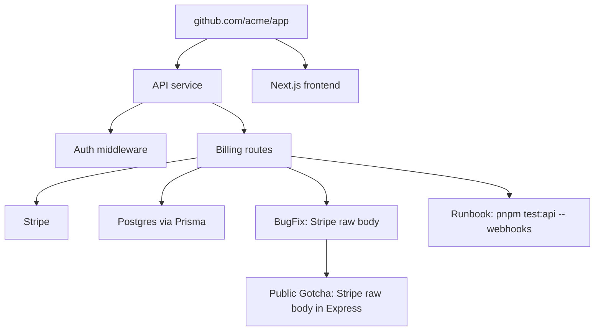

# Kage Knowledge Graph And Registry Design

Date: 2026-04-30

## 1. The Core Question

Kage is not just a memory note system. It needs to become a graph of:

- codebase facts
- decisions
- bugs and fixes
- runbooks
- conventions
- public framework knowledge
- skills
- MCP servers
- company documentation
- agent workflows

The graph should let an agent answer:

> What do I need to know, install, read, or run before doing this task?

## 2. What The Knowledge Graph Actually Is

The Kage graph has two layers:

### Layer A: Canonical Memory Packets

These are structured facts, documents, decisions, bugs, runbooks, skills, MCPs,
and docs.

Every packet has:

- stable ID
- type
- scope
- source refs
- permissions
- tags
- stack/version metadata
- freshness
- edges

### Layer B: Derived Graph Indexes

Indexes are generated from packets:

- entity index
- path index
- tag index
- package/version index
- error-message index
- repo/branch index
- graph edge index
- skill/MCP/doc registry index

The graph is not manually drawn. It is compiled.

### Graph Compilation Rules

The council review added one core invariant:

> Packets are truth. Graphs and indexes are rebuildable views.

Every generated graph artifact must record:

- source packet IDs
- packet hashes
- source git ref or bundle version
- schema version
- index generation ID
- build timestamp

Public and org graph bundles should be signed. Local repo indexes can be
regenerated from packets and should not create noisy git churn unless the team
explicitly chooses to commit small deterministic manifests.

## 3. Node Types

Kage needs more than "memory nodes."

```text
repo_map          generated architecture/codebase map
runbook           how to run/test/build/deploy/debug
bug_fix           symptom -> cause -> fix -> verification
decision          choice -> rationale -> alternatives
convention        repo/org-specific rule or pattern
workflow          multi-step recurring task
policy            mandatory org/repo instruction
public_gotcha     public framework/tooling failure mode
public_pattern    public reusable implementation pattern
doc_source        company/public documentation source
skill             agent skill package
mcp_server        MCP server package/config
tool_recipe       recommended tool/MCP/skill bundle for a task
```

## 4. Edge Types

Edges make it a graph instead of a folder of notes.

```text
depends_on        A requires B
implements        code component implements a concept/decision
owned_by          memory belongs to team/repo/domain
touches_path      memory applies to a path
uses_package      memory applies to dependency package/version
fixes_error       bug_fix resolves error signature
supersedes        A replaces B
conflicts_with    A and B cannot both be applied
similar_to        duplicate or related knowledge
promoted_from     public/org node came from private repo node
requires_skill    task/memory requires a skill
requires_mcp      task/memory requires an MCP server
references_doc    memory cites documentation
verified_by       memory was verified by test/CI/PR/user
```

## 5. How We Create The Knowledge Graph

There are five graph builders.

### 5.1 Repo Indexer

The repo indexer builds the first graph from source code.

Inputs:

- file tree
- manifests: `package.json`, `pyproject.toml`, `go.mod`, etc.
- README/CLAUDE/AGENTS files
- env examples
- routes/controllers
- schema/migrations
- tests
- CI config
- Docker/infra
- import graph

Outputs:

- repo overview node
- package/module nodes
- route/API nodes
- data model nodes
- auth/security nodes
- runbook nodes
- architecture graph
- path -> memory index
- package/version -> memory index

Repo index creation flow:

```text
scan file tree
  -> classify project type
  -> parse manifests
  -> build import/dependency graph
  -> identify domains
  -> read high-signal files
  -> generate repo_map packets
  -> validate source refs
  -> build indexes
```

Important: the repo indexer should use deterministic parsers where possible.
LLM summarization should compress verified facts, not invent structure.

Examples:

- TypeScript import graph can be built from AST/parser.
- package dependencies come from `package.json`.
- routes can be extracted from framework-specific patterns.
- database schema can be parsed from Prisma/SQL/migrations.
- LLM is used to explain the flow after facts are extracted.

### 5.2 Session Distiller

The session distiller does not build the repo graph. It proposes new edges and
memory packets after useful work.

Inputs:

- tool calls
- diffs
- commands run
- test failures/successes
- final outcome
- user approvals/corrections

Outputs:

- candidate bug_fix
- candidate workflow
- candidate convention
- candidate decision
- candidate runbook update

It should only write candidates. Review promotes them.

### 5.3 PR/Issue Miner

The GitHub/GitLab app can build memory from merged work.

Inputs:

- PR title/body
- review comments
- issue links
- files changed
- test status
- commit messages

Outputs:

- "what changed" memory
- bug fix memory
- decision memory
- source refs to PR/issue/commit

This may become the best low-friction capture path because developers already
review PRs. Kage can attach memory review to the existing PR workflow.

### 5.4 Documentation Ingestor

For internal or public docs:

Inputs:

- docs site sitemap
- Markdown/MDX
- OpenAPI specs
- READMEs
- changelogs
- issue trackers

Outputs:

- doc_source nodes
- API reference nodes
- versioned public gotchas/patterns
- citations for global nodes

Docs are not dumped whole into memory. They become searchable, cited doc nodes
and are linked to relevant memories.

### 5.5 Registry Builder

The registry builder indexes skills, MCP servers, documentation packs, and tool
recipes.

Inputs:

- skill manifests
- MCP server manifests
- package metadata
- company-submitted docs manifests
- compatibility metadata

Outputs:

- skill nodes
- MCP server nodes
- doc_source nodes
- recommended bundles

## 6. Repo Index And Graph

A repo graph should contain:

```text
Repo
  -> packages
  -> apps/services
  -> routes
  -> database models
  -> jobs/queues
  -> external services
  -> run/test/build commands
  -> deployment targets
  -> teams/owners
  -> known memories
```

Example:



## 7. Branch Semantics

Branches matter because memory can be true on one branch and false on another.

Kage should model memory validity by git refs.

### Main Branch Memory

Approved repo memory defaults to the default branch.

```json
{
  "valid_refs": ["refs/heads/main"],
  "source_sha": "abc123"
}
```

### Feature Branch Overlay

When a branch changes files, Kage creates an overlay:

```text
base graph: default branch at merge-base SHA
branch overlay: feature/webhook-refactor at head SHA
```

The overlay contains:

- files changed on branch
- candidate memories not merged
- stale warnings for memories touching changed paths
- branch-specific runbook changes

Retrieval uses:

```text
effective graph = main graph + branch overlay - invalidated main memories
```

Overlay identity:

```json
{
  "repo": "github.com/acme/app",
  "base_ref": "refs/heads/main",
  "base_sha": "abc123",
  "merge_base_sha": "abc123",
  "head_ref": "refs/heads/feature/webhook-refactor",
  "head_sha": "def456"
}
```

Invalidation should use more than string paths:

- blob hashes
- moved/renamed files
- symbol ownership
- import graph ownership
- package/lockfile changes
- deleted source refs
- failed verification tests

### Merge Behavior

When the branch merges:

- approved branch candidates become repo memory on main
- rejected candidates are discarded
- stale memories are superseded/deprecated
- source refs are updated to merge commit/PR

Rebases and cherry-picks should rebase overlays against the new merge base.
Forks should never promote memory into the upstream repo unless a maintainer
approves the PR-linked memory packet.

### Cross-Branch Protection

If a memory is based on files changed in a branch, it should not be shown as
canonical repo truth until merge. It can be shown as:

```text
[Branch Candidate] Observed on feature/webhook-refactor, not merged.
```

## 8. Cross-Repo Semantics

Org memory is how Kage works across repos.

Kage should infer cross-repo patterns:

- same package/version used in many repos
- same internal platform service
- same deployment system
- same auth conventions
- same repeated bug

Graph levels:

```text
repo graph
team graph
org graph
public graph
```

Example:

```text
repo memory: app uses internal payments client
team memory: payments team requires idempotency key for all webhooks
org memory: services deploy through internal platform gateway
public memory: Stripe webhook signatures require raw body
```

Retrieval blends all of them but respects permissions.

## 9. Review Without Tedious UX

Review will be tedious if Kage asks people to approve every small node.

The answer is not "remove review." The answer is smarter review lanes.

### Review Lanes

#### Auto-Approved Generated Index

Generated repo_map nodes can be auto-approved if:

- fully source-backed
- deterministic extraction
- no secrets
- no behavioral instruction

Example: route list, package list, command list.

#### Lightweight Human Review

Bug fixes, runbooks, and conventions need one-click review:

```text
Save to repo memory?

Title: Stripe webhook signature fails if JSON parser runs first
Evidence: PR #491, test passed, backend/webhooks/stripe.ts changed
Scope: repo

[Approve] [Edit] [Reject] [Personal only]
```

#### PR-Coupled Review

Best path for teams:

Kage comments on PR:

```text
Kage found 2 reusable learnings in this PR:

1. BugFix: Stripe webhook signature requires raw body
2. Runbook: Use pnpm test:api -- webhooks

[Commit memory packets to this PR] [Ignore]
```

This makes memory review part of code review, not a separate chore.

#### Batch Review

Daily or weekly digest:

```text
12 candidates
7 low risk
3 need edit
2 blocked by secret scan
```

Reviewer can approve low-risk candidates in bulk.

#### Suppression Controls

To prevent review fatigue, every suggestion surface should include:

- never ask for this repo
- never ask for this pattern
- keep personal only
- mark duplicate
- mark stale
- report unsafe

Review should measure burden:

- candidates per PR
- approve rate
- edit rate
- reject reason
- time to review

### Public Promotion Should Be Separate

Do not ask users to contribute publicly during normal flow.

Ask only when:

- memory is generic
- no private source refs
- similar public node does not exist
- the user just benefited from public graph
- rewrite is already prepared

Prompt:

```text
This looks useful beyond your repo.
Kage prepared a public-safe version with no private details.

[Submit to public graph] [Keep private] [Never ask for this repo]
```

## 10. Incentives To Contribute

Users need a reason to contribute to the public/global CDN.

### Practical Incentives

- Their own agents get better public recall.
- Their team earns private/org graph quality improvements.
- Public contributions can be reused in future projects.
- Kage handles sanitization and PR creation.

### Reputation Incentives

Create contributor profiles:

- accepted nodes
- helpful votes
- stale fixes
- top domains
- company/team badges

Example:

```text
@alice
42 accepted public nodes
Top domains: Next.js, Stripe, Prisma
Helpfulness score: 94%
```

### Company Incentives

Companies can publish official docs packs:

- "Official Stripe Kage Pack"
- "Official Vercel Deployment Pack"
- "Acme Platform Internal Pack"

Benefits:

- fewer support tickets
- agents use official, versioned guidance
- docs become executable agent context
- companies can see anonymized usage signals if users opt in

### Reciprocity Incentive

Public graph can have soft rate/quality benefits:

- contributors get faster review
- maintainers get verified badges
- high-quality packs rank higher
- agent surfaces "official" and "community accepted" labels

### Do Not Rely On Altruism

The main incentive should be: Kage makes contribution almost effortless and
immediately useful to the contributor.

### Avoid Volume Incentives

Reputation should not reward raw node count. Reward:

- accepted reuse
- stale fixes
- verified updates
- conflict resolution
- high helpfulness
- low rollback/report rate

Team dashboards should emphasize avoided rediscovery:

```text
This memory was recalled 12 times and helped 7 merged PRs avoid rediscovery.
```

## 11. Skills, MCPs, And Docs Registry

Kage should include a registry so users do not manually install every skill, MCP,
or docs pack.

This becomes a second public CDN:

```text
registry/
  catalog.json
  skills/{publisher}/{name}/{version}/manifest.json
  mcps/{publisher}/{name}/{version}/manifest.json
  docs/{publisher}/{name}/{version}/manifest.json
  bundles/{domain}/{name}.json
```

## 12. Skill Manifest

```json
{
  "kind": "skill",
  "publisher": "kage-core",
  "name": "stripe-webhooks",
  "version": "1.2.0",
  "title": "Stripe Webhook Implementation Skill",
  "description": "Guides agents through Stripe webhook verification, idempotency, and testing.",
  "domains": ["payments", "api-design"],
  "tags": ["stripe", "webhook", "hmac", "idempotency"],
  "requires": {
    "agents": ["claude-code", "codex"],
    "permissions": ["read_repo"],
    "mcps": []
  },
  "entry": {
    "type": "markdown",
    "url": "https://cdn.kage.dev/skills/kage-core/stripe-webhooks/1.2.0/SKILL.md"
  },
  "integrity": {
    "sha256": "..."
  },
  "trust": {
    "level": "verified_publisher",
    "reviewed_by": ["kage-core"],
    "created_at": "2026-04-30"
  }
}
```

## 13. MCP Manifest

```json
{
  "kind": "mcp_server",
  "publisher": "stripe",
  "name": "stripe-docs",
  "version": "0.4.0",
  "title": "Stripe Docs MCP",
  "description": "Search Stripe API docs and webhook references.",
  "transport": "stdio|http",
  "install": {
    "command": "npx",
    "args": ["@stripe/mcp-docs"]
  },
  "tools": [
    {
      "name": "stripe_docs_search",
      "description": "Search Stripe docs"
    }
  ],
  "permissions": {
    "network": ["docs.stripe.com"],
    "filesystem": "none",
    "secrets": []
  },
  "integrity": {
    "package": "@stripe/mcp-docs",
    "sha256": "..."
  },
  "trust": {
    "level": "official",
    "publisher_domain": "stripe.com"
  }
}
```

## 14. Documentation Pack Manifest

Companies can publish docs to Kage CDN.

```json
{
  "kind": "doc_pack",
  "publisher": "vercel",
  "name": "nextjs-docs",
  "version": "15.3.0",
  "title": "Next.js Official Docs",
  "source": {
    "type": "sitemap",
    "url": "https://nextjs.org/docs/sitemap.xml"
  },
  "license": "public-docs",
  "domains": ["frontend", "deployment"],
  "tags": ["nextjs", "react", "app-router", "vercel"],
  "indexes": {
    "search": "https://cdn.kage.dev/docs/vercel/nextjs-docs/15.3.0/search.json",
    "chunks": "https://cdn.kage.dev/docs/vercel/nextjs-docs/15.3.0/chunks/"
  },
  "freshness": {
    "last_crawled": "2026-04-30",
    "ttl_days": 7
  },
  "trust": {
    "level": "official",
    "publisher_domain": "vercel.com"
  }
}
```

## 15. Auto-Discovery Of Skills, MCPs, Docs

When a user enters a repo, Kage computes a repo fingerprint:

```json
{
  "languages": ["typescript"],
  "frameworks": ["nextjs"],
  "packages": ["stripe", "prisma", "next"],
  "services": ["vercel"],
  "domains": ["frontend", "payments", "database"]
}
```

Kage then recommends:

```text
Recommended Kage Packs for this repo:

1. Next.js Official Docs Pack
2. Stripe Webhooks Skill
3. Prisma Serverless Gotchas
4. Vercel Deployment Docs

[Enable recommended] [Choose manually] [Not now]
```

This should not auto-install arbitrary MCP servers silently. MCPs can execute
tools, so they need user/org approval.

Docs and static public graph indexes are read-only, but still untrusted context.
They can be enabled with lower friction than MCPs, but Kage must wrap them with
prompt-injection defenses and provenance labels. Read-only does not mean safe.

## 16. Tool Recipe Bundles

A bundle combines memory, docs, skills, and MCP servers for a domain.

Example:

```json
{
  "kind": "tool_recipe",
  "id": "payments/stripe-webhooks",
  "title": "Stripe Webhook Workbench",
  "includes": {
    "public_memories": ["payments/stripe-webhook-signature-raw-body"],
    "skills": ["kage-core/stripe-webhooks@1.2.0"],
    "docs": ["stripe/stripe-docs@2026-04"],
    "mcps": ["stripe/stripe-docs@0.4.0"]
  },
  "activation": {
    "packages": ["stripe"],
    "paths": ["webhook", "payments", "billing"],
    "task_keywords": ["webhook", "signature", "stripe"]
  }
}
```

When an agent works on Stripe webhooks, Kage can recall both repo memory and the
right skill/docs/tools.

## 17. Trust And Security For Registry

Registry content must have trust levels:

```text
official            verified domain owner
verified_publisher  reviewed known publisher
community_reviewed  passed review, not official
local_org           internal company registry
experimental        user-installed only
blocked             known unsafe/stale
```

MCP server installation should show:

- exact command
- network access
- filesystem access
- secrets requested
- publisher trust
- package integrity
- last review date

Trust levels require operational backing:

- verified domain ownership
- signed manifests
- pinned versions
- publisher identity
- SBOM/provenance where applicable
- malware and prompt-injection review
- review expiry
- revocation list
- transparency log
- vulnerability response process

Skills are executable instructions for agents. MCPs are executable tools. Docs
and public memories are untrusted context. Kage must treat all three as supply
chain inputs.

### MCP Sandbox Policy

Declared MCP permissions are not enough. Kage should run MCP servers through a
deny-by-default launcher that enforces:

- no ambient environment access
- filesystem allowlists
- network egress allowlists
- explicit secret grants
- pinned package versions
- blocked postinstall behavior where possible
- per-tool audit logs
- org allow/deny catalogs

Org admins should be able to approve a catalog:

```text
Allowed:
- official docs packs
- kage-core skills
- approved MCP servers

Blocked:
- unreviewed MCP servers
- MCPs requesting broad filesystem access
```

### Launch Registry Wedge

The first launch should not be a broad marketplace. Start with:

- curated Kage-core public memory packs
- read-only docs packs for 2-3 ecosystems
- skills for those same ecosystems
- MCP recommendations only, with manual approval

Good initial ecosystems:

- Next.js
- Stripe
- Prisma

The product should prove that Kage recommends the right context before it tries
to become a universal registry.

## 18. How It All Works Together

User opens repo:

```text
Kage detects:
- Next.js
- Stripe
- Prisma
- Vercel

Kage loads:
- repo memory
- org platform memory
- public Next.js/Stripe/Prisma gotchas
- official docs packs
- recommended skills

Kage asks:
- enable Stripe Docs MCP?
- enable Prisma migration skill?
```

Agent starts task:

```text
User: Fix webhook signature failing in staging.

Agent calls kage_recall.

Kage returns:
- repo bug memory from prior branch/PR
- runbook command for webhook tests
- public Stripe raw-body gotcha
- Stripe webhook skill
- link to official Stripe docs pack
- optional Stripe Docs MCP if approved
```

Agent solves task, Kage proposes:

```text
Save repo memory:
- staging uses API gateway that strips body unless route is allowlisted

Promote public? No, this is org-specific.
Promote org? Yes, applies to other services behind the same gateway.
```

## 19. Answering The Original Questions

### How are we creating the knowledge graph?

By compiling structured memory packets and source-derived facts into generated
indexes and edges. The graph comes from repo indexing, session distillation,
PR/issue mining, documentation ingestion, and registry manifests.

### Will review be tedious?

It will be tedious if every candidate is a separate chore. It will work if
review is:

- PR-coupled
- one-click
- batched
- risk-tiered
- auto-approved for deterministic generated facts
- separate for public promotion

### Why would users contribute?

Because Kage gives immediate value back:

- their own future agents get smarter
- teammates avoid rediscovery
- public contribution is prepared automatically
- contributors earn reputation
- companies reduce support burden by publishing official packs

### How does repo indexing work across branches?

Default branch memory is canonical. Feature branches get overlays. On merge,
approved branch memories become canonical; stale memories are superseded.

### How does this work across repos?

Repo memory stays repo-scoped. Org memory captures shared private patterns across
repos. Public memory captures generic framework/tooling knowledge. Retrieval
blends all scopes with permission checks.

### How do skills, MCPs, and docs fit?

They become graph nodes and registry assets. Kage recommends and enables the
right docs/skills/MCPs based on repo fingerprint and task context, with trust and
security gates.

## 20. Council Decisions

The subagent council converged on these changes:

1. Build repo-local recall first. The full registry is the future, not the first
   product.
2. Make first-run value obvious: run commands, test commands, detected stack,
   and relevant public gotchas.
3. Keep generated graph artifacts disposable and signed/versioned.
4. Treat docs, public memories, skills, and MCP manifests as untrusted context.
5. Require sandbox enforcement for MCP execution.
6. Use branch overlays keyed by merge base and head SHA.
7. Make review PR-coupled, one-click, suppressible, and batched.
8. Reward useful contribution and maintenance, not volume.
