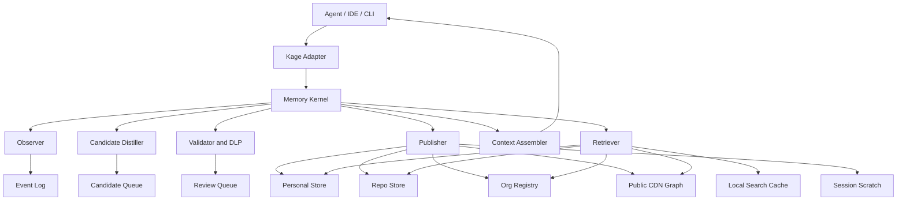
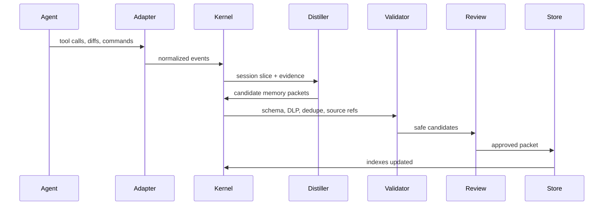

# Kage Memory System Design

Date: 2026-04-30

## 1. Product Promise

Kage is a shared memory system for coding agents.

After install, an agent should know:

- what this repo is
- how to run, test, build, deploy, and debug it
- how major code flows work
- what bugs were already solved
- what decisions were made and why
- what conventions must be followed
- what framework gotchas apply from the public world
- what teammates' agents learned while working here

The product promise:

> If one person solved it with an agent, the next person's agent should not
> rediscover it.

## 2. First-Principles Design

The system must treat memory as infrastructure, not prompt text.

### Core Beliefs

1. Memory is not transcript storage.
2. Memory is not documentation.
3. Memory is not a vector database alone.
4. Memory is source-backed, scoped, reviewed, versioned knowledge.
5. Every memory needs provenance, permissions, freshness, and a way to die.
6. Retrieval is the product. A perfect memory that is not recalled at the right
   time is useless.
7. Sharing must follow trust boundaries: session -> personal -> repo -> org ->
   public.

### Council Invariants

These are hard design constraints from the subagent council review:

1. **Packets are truth.** Canonical memory packets are the source of truth.
   Indexes, embeddings, summaries, graph views, and CDN bundles are disposable
   derived artifacts.
2. **Scope determines authority.** Repo memory beats org/public memory for
   repo-specific tasks. Branch overlays beat default-branch memory only inside
   that branch context.
3. **Agents propose, humans approve.** Agents may create candidates, but shared
   repo/org/public writes require human or policy-controlled approval.
4. **Redact before persistence.** Raw events must pass a pre-ingestion privacy
   gate before storage, indexing, embedding, logging, or LLM distillation.
5. **Permissions apply before retrieval.** ACL filtering must happen before
   candidate generation, not only before final display.
6. **Registry content is untrusted context.** Docs, skills, public memories, and
   MCP metadata can prompt-inject agents even when read-only.
7. **MVP must make recall magical first.** Launch with trustworthy repo memory
   and excellent recall before building the full org registry and marketplace.

### Non-Goals

- Do not upload all code to a central service by default.
- Do not auto-publish private repo learnings to a public graph.
- Do not require a heavy daemon for the basic local workflow.
- Do not make agents read every memory file.
- Do not block quick work with mandatory recall prompts.

## 3. System Name

Working name: **Kage Memory Kernel**.

The kernel is the part every agent integrates with. Claude Code, Codex, Cursor,
Windsurf, GitHub Actions, and IDEs are adapters.

## 4. Architecture



### Components

#### Adapter

The adapter connects a host environment to Kage.

Examples:

- Claude Code hooks
- Codex CLI or desktop integration
- Cursor/Windsurf extension
- GitHub PR/issue app
- CI adapter
- MCP server/client

Adapters emit normalized events and call recall/capture APIs.

#### Memory Kernel

The kernel handles:

- event ingestion
- candidate creation
- schema normalization
- dedupe/upsert
- secret/PII scanning
- retrieval
- context assembly
- publishing
- audit logs

#### Stores

Kage uses multiple stores:

- event log: short retention, local/private
- packet store: canonical memory objects
- search index: BM25, vectors, path index
- edge index: relationships between memories
- audit log: reads, writes, promotions

### Source Of Truth And Sync

Each scope has exactly one authority:

```text
session   -> local scratch store
personal  -> encrypted local personal store
repo      -> packets in git on the relevant ref
org       -> authenticated org registry
public    -> signed public CDN bundle source repository
```

Derived artifacts must carry:

- `packet_hash`
- `schema_version`
- `index_generation_id`
- `built_from_ref`
- `built_at`

Writes need idempotency keys and compare-and-swap semantics. If two agents
propose or edit the same memory, Kage should detect duplicate or conflicting
packets before writing. Local caches are rebuildable and must never be treated
as authoritative.

## 5. Memory Scopes

### Session Memory

Use for same-session discoveries.

- lifetime: current session
- storage: local scratch
- review: none
- shared: no

Example:

"We just discovered the failing test is `webhook.signature.spec.ts`."

### Personal Memory

Use for one developer's preferences and cross-project learnings.

- lifetime: long-term
- storage: local encrypted store
- review: user optional
- shared: no by default

Example:

"I prefer direct answers and usually use pnpm."

### Repo Memory

Use for knowledge specific to a repository.

- lifetime: long-term
- storage: `.agent_memory/packets/*.json` in git
- review: repo review or PR
- shared: everyone with repo access

Example:

"All API requests require `x-tenant-id` except public health checks."

### Org Memory

Use for private knowledge reusable across repos.

- lifetime: long-term
- storage: authenticated org registry
- review: owner/team review
- shared: users with permissions

Example:

"Internal service clients use mTLS through the platform gateway."

### Public Memory

Use for generic framework/tooling knowledge safe for everyone.

- lifetime: long-term with TTL
- storage: public static CDN graph
- review: public graph maintainers
- shared: everyone

Example:

"Stripe webhook signature verification requires raw request bodies in Express."

## 6. Memory Types

Kage should support these first-class memory types:

```text
repo_map       architecture, routes, schema, package boundaries
runbook        commands, local setup, env vars, deployment steps
bug_fix        symptom, cause, fix, regression test
decision       choice, alternatives, rationale, revisit trigger
convention     repo-specific pattern or rule
workflow       how to complete a recurring task
gotcha         common failure mode
reference      dense lookup table
policy         mandatory org/repo rule
```

## 7. Canonical Memory Packet

All memories compile to a packet. Markdown is a view, not the source of truth.

```json
{
  "schema_version": 2,
  "id": "repo:github.com/acme/app:bug_fix:stripe-webhook-raw-body",
  "title": "Stripe webhook signature fails if JSON parser runs first",
  "summary": "Stripe signature verification needs the raw request body before JSON parsing.",
  "body": "Symptom, cause, fix, verification, never-do.",
  "type": "bug_fix",
  "scope": "repo",
  "visibility": "team",
  "sensitivity": "internal",
  "status": "approved",
  "confidence": 0.91,
  "tags": ["stripe", "webhook", "express", "raw-body"],
  "paths": ["backend/webhooks", "backend/payments"],
  "stack": ["express@>=4", "stripe-node@>=12"],
  "source_refs": [
    {
      "kind": "commit",
      "repo": "github.com/acme/app",
      "sha": "abc123"
    },
    {
      "kind": "file",
      "path": "backend/webhooks/stripe.ts",
      "sha": "abc123"
    },
    {
      "kind": "pr",
      "url": "https://github.com/acme/app/pull/491"
    }
  ],
  "permissions": {
    "inherits_from": "repo",
    "repo": "github.com/acme/app",
    "teams": ["payments"]
  },
  "freshness": {
    "ttl_days": 365,
    "last_verified_at": "2026-04-28",
    "verification": "test_passed"
  },
  "edges": [
    {
      "rel": "depends_on",
      "target": "repo:github.com/acme/app:repo_map:api-routes"
    }
  ],
  "quality": {
    "reviewer": "@alice",
    "votes_up": 4,
    "votes_down": 0,
    "uses_30d": 19,
    "reports_stale": 0
  },
  "created_at": "2026-04-28T10:22:00Z",
  "updated_at": "2026-04-28T10:22:00Z"
}
```

## 8. Storage Layout

### Repo Store

```text
.agent_memory/
  packets/
    *.json
  views/
    nodes/
      *.md
    SUMMARY.md
    architecture.md
  indexes/
    catalog.json
    by-path.json
    by-tag.json
    by-type.json
    graph.json
  pending/
    *.json
  kage.lock
```

Rules:

- `packets/*.json` is canonical.
- `views/*` and `indexes/*` are generated.
- `pending/*` can be gitignored or committed depending on team policy.
- CI validates all packets.

### Personal Store

```text
~/.kage/personal/
  cache.sqlite
  packets/
  pending/
```

Encryption should be mandatory for personal/local caches that store workplace
memory. Enterprise deployments should support KMS/BYOK, retention limits, and
hard-delete propagation into derived indexes.

### Org Registry

MVP storage can be a private repo or object-store bundle. Scale storage should
use:

- Postgres for packets, permissions, audit logs
- pgvector or external vector DB for embeddings
- OpenSearch or SQLite FTS for BM25 style text search
- edge table for graph traversal
- object store for generated bundles and large artifacts

### Public CDN Graph

```text
catalog.json
domains/{domain}/index.json
domains/{domain}/nodes/{slug}.json
domains/{domain}/nodes/{slug}.md
tags/{tag}.json
errors/{normalized_error_hash}.json
packages/{package}/versions/{range}.json
```

## 9. Event Model

Adapters emit events. Events are not memories.

### Pre-Ingestion Privacy Gate

Before any event is persisted, embedded, indexed, logged, or sent to an LLM, it
must pass a local privacy gate:

- secret scanning
- PII scanning
- internal hostname and URL scanning
- path allow/deny rules
- enterprise custom detectors
- canary-secret tests
- retention classification

Events that fail are either redacted, summarized locally, or blocked. This keeps
the event log from quietly becoming transcript-adjacent sensitive storage.

```json
{
  "event_id": "evt_123",
  "session_id": "sess_456",
  "actor": "agent|user|ci|github",
  "event_type": "file_changed|command_run|test_failed|test_passed|pr_merged|issue_comment",
  "repo": "github.com/acme/app",
  "branch": "feature/webhook-fix",
  "timestamp": "2026-04-30T09:00:00Z",
  "payload": {},
  "sensitivity_hint": "internal"
}
```

The event log allows Kage to understand work. The distiller decides whether any
resolved knowledge should become memory.

## 10. Capture Flow



Capture should happen in three ways:

1. **Inline explicit save**: agent knows something is useful and calls
   `kage_capture`.
2. **Background proposal**: session end or PR merge proposes candidates.
3. **Source-derived indexing**: repo indexer updates codebase map memory.

Only approved packets become shared memory.

## 11. What Makes A Good Memory

A memory is worth storing if a future agent would act differently because of it.

Candidate scoring:

```text
future_reuse_score =
  specificity
  + source_evidence
  + recurrence_likelihood
  + task_impact
  + verification_strength
  - sensitivity_risk
  - staleness_risk
  - duplicate_similarity
```

Store when:

- it prevented or fixed a bug
- it explains a non-obvious decision
- it encodes a command or workflow that worked
- it maps a code flow agents repeatedly need
- it captures a convention not obvious from code
- it links public framework behavior to this repo

Do not store when:

- it is just a file summary
- it is speculation
- it duplicates code comments
- it contains secrets or private customer data
- it is temporary state

## 12. Retrieval Flow

Agents call one tool:

```text
kage_recall(query, context)
```

Input:

```json
{
  "query": "fix stripe webhook signature failure",
  "repo": "github.com/acme/app",
  "branch": "feature/webhook-fix",
  "paths": ["backend/webhooks/stripe.ts"],
  "task_type": "debugging",
  "scopes": ["repo", "org", "personal", "public"],
  "budget_tokens": 1400
}
```

Output:

```json
{
  "context_block": "...agent-ready text...",
  "results": [
    {
      "id": "repo:github.com/acme/app:bug_fix:stripe-webhook-raw-body",
      "title": "Stripe webhook signature fails if JSON parser runs first",
      "scope": "repo",
      "type": "bug_fix",
      "confidence": 0.91,
      "why_matched": ["path overlap", "stripe webhook tags", "debugging task"],
      "source_refs": ["PR #491", "backend/webhooks/stripe.ts@abc123"]
    }
  ],
  "actions": ["fetch_full", "mark_stale", "save_new", "promote"]
}
```

## 13. Retrieval Ranking

Use a multi-stage retrieval pipeline, not a single static score:

```text
1. hard filters
2. candidate retrieval
3. intent-aware reranking
4. conflict and duplicate collapse
5. context assembly
```

Hard filters:

- permission and field-level ACL
- status: approved, not blocked
- repo/branch validity
- source availability
- package/version compatibility
- supersession/deprecation

Then use hybrid ranking:

```text
score =
  0.25 * exact_text_match
  + 0.20 * embedding_similarity
  + 0.20 * path_overlap
  + 0.10 * graph_proximity
  + 0.10 * freshness
  + 0.10 * authority
  + 0.05 * prior_use_success
  - penalties
```

Penalties:

- stale
- deprecated
- superseded
- low confidence
- user marked wrong
- version mismatch
- permission risk

Mandatory policy/runbook memories can be pinned even if not top-ranked.

Intent boosts:

- debugging: exact errors, `bug_fix`, test commands, changed paths
- implementation: conventions, repo maps, examples, decisions
- deployment: runbooks, config, policy, CI history
- refactor: architecture graph, ownership, supersession, tests

Scope precedence:

```text
branch candidate > repo > team/org > personal > public
```

Public memories are supporting evidence unless there is no repo/org match or
the public node has an exact error/package/version match.

## 14. Context Assembly

The retriever should not dump nodes. It should assemble a context block.

Context block layout:

```text
Kage Context

Repo Identity:
- github.com/acme/app, branch feature/webhook-fix

Pinned Rules:
- Billing changes require webhook replay tests.

Runbook:
- Use `pnpm test:api -- webhooks`.

Relevant Memory:
1. [repo bug_fix, verified] Stripe webhook signature fails if JSON parser runs first.
   Fix: register raw parser on webhook route before JSON parser.
   Source: PR #491, backend/webhooks/stripe.ts@abc123

2. [public gotcha, fresh] Stripe signature verification requires raw body in Express.
   Applies: express@>=4, stripe-node@>=12

Warnings:
- Existing memory says older middleware path was superseded on 2026-04-28.
```

The assembler should obey token budgets:

- 200 tokens for pinned rules
- 300 tokens for runbook
- 700 tokens for relevant memories
- 200 tokens for warnings/source refs

## 15. APIs

### MCP Tools

```text
kage_recall
kage_capture
kage_review_queue
kage_approve
kage_reject
kage_deprecate
kage_promote
kage_explain
kage_feedback
kage_index_repo
kage_validate
```

### CLI

```text
kage init
kage index
kage recall "query"
kage capture --from-session
kage review
kage validate
kage promote <id> --to org
kage promote <id> --to public
kage deprecate <id>
kage audit
```

### Internal HTTP API

```text
POST /events
POST /memories/candidates
POST /memories
GET  /recall
POST /feedback
POST /promotions
GET  /audit
```

## 16. Permission Model

Permissions are evaluated at query time and write time.

Rules:

- Repo memories inherit repo access.
- Org memories inherit team/org access.
- Personal memories are local/private.
- Public memories have no private source refs.
- Promotion never bypasses review.
- Every read/write/promotion is auditable.

Query context must include:

```json
{
  "user": "github:alice",
  "org": "acme",
  "repo": "github.com/acme/app",
  "teams": ["payments", "platform"],
  "client": "codex",
  "scopes_requested": ["repo", "org", "public"]
}
```

The server returns only memories the user could already access.

## 17. Privacy And Safety

Before any memory leaves session/personal scope:

- scan for secrets
- scan for PII
- scan for internal hostnames
- classify sensitivity
- require source refs
- require review

Shared write controls:

- agents can propose, not approve
- policy memories and public promotions require stronger review
- packet signatures are required for repo/org/public packets
- derived indexes and CDN bundles are signed
- revocation lists must invalidate local/org caches
- audit logs must record reads, writes, promotions, and denied attempts

Public promotion also requires:

- no private paths unless generalized
- no private company names unless explicitly public
- public citations when possible
- no copied proprietary content
- rewritten generic examples

## 18. Global StackOverflow-For-Agents Graph

The public graph should feel like StackOverflow plus GitHub issues, but built
for agents.

### Public Node Types

```text
gotcha       symptom -> cause -> fix -> scope
pattern      implementation blueprint
config       exact version-sensitive config
decision     tradeoff and when to choose it
reference    dense lookup table
issue        known public framework issue and workaround
```

### Public Quality Signals

- maintainer reviewed
- public source citations
- version compatibility
- freshness TTL
- uses by agents
- votes by humans
- reports stale/wrong
- conflict edges
- supersession edges

### Public Retrieval

Global graph search should support:

- exact error message lookup
- package/version lookup
- framework issue lookup
- tag/domain search
- related fixes
- alternatives
- conflicts

### Public Contribution

Agents can propose, humans approve.

```text
repo memory -> sanitize -> public candidate -> CI validation -> maintainer review -> CDN
```

## 19. Scaling Model

### Local Scale

Target:

- 10k repo memories
- recall under 100 ms from local cache
- no daemon required

Use:

- SQLite FTS
- generated JSON indexes
- optional local embeddings

### Org Scale

Target:

- 10k repos
- 10M memories
- p95 recall under 300 ms
- strict permission filters

Use:

- shard by org
- partition by repo/scope/type
- precompute embeddings
- maintain BM25 and vector indexes
- cache hot repo/org context bundles
- async writes through queue

### Public Scale

Target:

- 1M public nodes
- global read latency under 500 ms
- cheap CDN reads

Use:

- static generated indexes
- domain/tag/error/package shards
- client-side and edge caching
- periodic rebuild jobs

## 20. Deployment Modes

### Solo Developer

- local CLI
- local SQLite
- repo `.agent_memory`
- public CDN graph

### Team

- repo memory in git
- GitHub app for PR review
- local cache
- optional private org bundle

### Enterprise

- authenticated org registry
- SSO
- SCIM/team sync
- audit logs
- private deployment
- policy memories
- no public promotion unless enabled

## 21. MVP We Should Build

Build the smallest system that proves the real product:

1. Packet schema v2.
2. Repo store with generated indexes.
3. Local SQLite FTS cache.
4. `kage_recall` MCP tool.
5. `kage_capture` candidate flow.
6. `kage review`.
7. Secret scanning.
8. Source refs from git diff/commit.
9. Public graph search fixed and schema-stable.
10. Promotion stub from repo -> public candidate.

Council cut line:

- skip org cloud for MVP
- skip broad marketplace registry for MVP
- skip automatic MCP discovery for MVP
- skip public contribution beyond a prepared candidate export
- skip vectors until BM25/path/tag recall is reliable
- keep public graph read-only and curated at first

First-launch success criterion:

> Within five minutes of install, Kage should tell the agent how to run/test the
> repo and recall at least one useful repo or public gotcha during real work.

## 22. How Current Kage Maps To This

Keep:

- `.agent_memory/`
- pending review
- repo indexer
- public CDN graph
- MCP interface

Replace:

- prompt-only memory writes with packet writer
- manual indexes with generated indexes
- hard UserPromptSubmit enforcement with `kage_recall`
- background `bypassPermissions` capture as default with opt-in candidates
- Markdown-as-db with JSON packets plus Markdown views

Add:

- local cache
- schema validation
- DLP scanner
- dedupe/upsert
- source refs
- freshness and supersession
- org registry
- promotion workflow

## 23. Engineering Roadmap

### Week 1: Fix Foundations

- fix global catalog schema mismatch
- remove stale scripts
- define packet schema
- implement packet validator
- generate indexes from packets

### Week 2: Local Recall

- create SQLite cache
- index repo packets
- implement BM25/path/tag search
- implement `kage_recall`
- generate context block

### Week 3: Capture And Review

- implement `kage_capture`
- propose memory from session summary/diff
- add DLP/secret scanning
- add dedupe detection
- build review command

### Week 4: Public Graph V2

- stabilize public schema
- add JSON node files
- add package/error indexes
- add promotion candidate generator
- add CI validation

### Month 2: Org Memory

- private registry MVP
- GitHub auth
- repo/team permission inheritance
- audit logs
- org recall blend

### Month 3: Universal Harness

- Codex adapter
- Claude Code adapter
- Cursor/Windsurf adapter
- GitHub app
- CI adapter
- eval harness

## 24. Evaluation

Kage succeeds only if it reduces rediscovery.

Metrics:

- recall precision@3
- required memory recall@5
- harmful recall rate
- stale memory shown rate
- secret leakage rate
- duplicate memory rate
- command rediscovery time
- time to first passing test
- user re-explanation count
- memory approval rate
- memory reuse rate
- context block usefulness
- capture false positive/false negative rate

Benchmark tasks:

- run project locally
- fix known bug
- implement endpoint following repo pattern
- debug CI failure
- update auth flow
- add DB migration
- handle framework gotcha

Eval datasets should include required memories, distractor memories, stale
memories, branch-specific variants, permission boundaries, and long-horizon
growth tests at 100, 1k, and 10k memories.

## 25. The Design In One Sentence

Kage should be an agent memory kernel that turns coding work into reviewed,
source-backed, permission-aware memory packets and retrieves the smallest
possible context block that lets the next agent avoid rediscovery.
