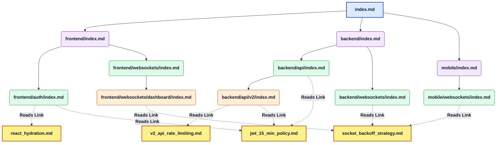

# 🧠 Kage: Cross-Functional Agent Memory as Code

Welcome to **Kage** (the shared Agent Memory framework). This architecture solves the "Isolated Agent" problem by using Git and Markdown files to synchronize crucial architectural insights, framework bugs, and repository context across an entire engineering team and their AI tools (Cursor, Claude, AntiGravity).

---

## ⚡ Quickstart

**Requirements:** Python 3.8+, an API key for your chosen LLM provider (Anthropic, OpenAI, or local Ollama)

### macOS / Linux — one command

```bash
# Run directly from GitHub into any repo:
cd /path/to/your-repo
ANTHROPIC_API_KEY=sk-ant-... bash <(curl -fsSL https://raw.githubusercontent.com/Kage18/Kage/master/setup.sh)
```

Or clone first:
```bash
git clone https://github.com/Kage18/Kage.git
cd /path/to/your-repo
ANTHROPIC_API_KEY=sk-ant-... bash /path/to/Kage/setup.sh
```

### Windows — one command

```powershell
# From your repo directory:
$env:ANTHROPIC_API_KEY="sk-ant-..."
git clone https://github.com/Kage18/Kage.git $env:TEMP\Kage
& "$env:TEMP\Kage\setup.ps1"
```

### What the setup script does

| Step | What it sets up |
|------|----------------|
| 1 | Installs Python SDK for your chosen provider |
| 2 | Scaffolds `.agent_memory/` with indexes, scripts, pending/, deprecated/ |
| 3 | Installs `.claude/agents/kage-memory.md` — the retrieval sub-agent |
| 4 | Copies `kage.py` CLI and `kage.config.json` to repo root |
| 5 | Creates `CLAUDE.md` telling the main agent to delegate to `kage-memory` |
| 6 | Creates `.cursorrules` for Cursor IDE |
| 7 | Installs `.git/hooks/post-commit` to auto-distill each commit |
| 8 | Installs `.git/hooks/post-merge` to auto-rebuild indexes after pulls |
| 9 | Starts a background daemon watching Claude Code sessions every 5 minutes |

After setup, **everything is automatic** — just code normally and Kage captures the knowledge.

---

## 🛠️ The `kage` CLI

All memory operations go through `kage.py` at your repo root:

```bash
# Review AI-staged memories before they become rules
python3 kage.py review

# Interactively save a new learning
python3 kage.py save

# Deprecate a stale/outdated node
python3 kage.py prune

# Check all relative markdown links in .agent_memory/
python3 kage.py check-links

# Regenerate SUMMARY.md (compact, token-efficient overview for AI context)
python3 kage.py digest

# Rebuild all index.md files from node frontmatter (resolves merge conflicts)
python3 kage.py rebuild-indexes
```

---

## 🔒 Enterprise Features

### PII & Secret Scrubbing
Every transcript and commit diff is automatically scrubbed for API keys, tokens, private keys, and passwords before being sent to an LLM or written to disk. Detected patterns include `sk-ant-*`, `sk-*`, `ghp_*`, `AIza*`, AWS keys, PEM blocks, and generic `password=` / `token=` pairs.

### Human-in-the-Loop Review
By default (`pending_review: true` in `kage.config.json`), all automatically distilled memories are staged in `.agent_memory/pending/` instead of being written directly. No AI hallucination can become a permanent rule without a human approving it:

```bash
python3 kage.py review
# [1/2] JWT Expiration Policy
# Category: architecture | Tags: ["auth"] | Paths: backend
# ...
# (a)pprove / (r)eject / (s)kip:
```

To disable review and write directly, set `"pending_review": false` in `kage.config.json`.

### Multi-Model Support
Kage is not locked to Anthropic. Edit `kage.config.json` to switch providers:

```json
{ "provider": "openai",    "model": "gpt-4o" }
{ "provider": "ollama",    "model": "llama3" }
{ "provider": "anthropic", "model": "claude-sonnet-4-6" }
```

Install the matching SDK: `pip install openai` or run Ollama locally — no code changes needed.

### Memory Pruning
Deprecate outdated nodes without deleting history:

```bash
python3 kage.py prune
# [1] jwt_15_min_policy  architecture  2024-01-15
# Enter node number to deprecate: 1
```

Deprecated nodes move to `.agent_memory/deprecated/` and their links are removed from all indexes automatically.

### Link Validation
Catch broken relative paths before they silently break the memory graph:

```bash
python3 kage.py check-links
# OK     backend/index.md -> ../nodes/jwt_policy.md
# BROKEN frontend/index.md -> ../nodes/missing_file.md
```

### Context Window Efficiency — `kage-memory` Sub-Agent

The main agent never loads memory files directly. Instead, `CLAUDE.md` instructs it to delegate to the `kage-memory` sub-agent whenever it needs to check rules:

```
Main agent: "about to implement JWT auth middleware"
    ↓
kage-memory sub-agent:
  reads .agent_memory/index.md          → sees "backend" domain
  reads .agent_memory/backend/index.md  → sees JWT policy link
  reads .agent_memory/nodes/jwt_policy.md
    ↓
Main agent receives: 1 relevant node, zero index navigation overhead
```

The sub-agent is installed at `.claude/agents/kage-memory.md` and is automatically available in Claude Code. The hierarchical index is navigated by the sub-agent, not the main agent — so it never bloats the working context.

`SUMMARY.md` is still generated for Cursor IDE and human browsing, but is not the primary retrieval path for Claude Code.

### Merge Conflict Resolution
When multiple developers commit memories simultaneously, `index.md` files can get merge conflicts. Indexes are derived artifacts — never hand-edit them. Instead:

```bash
# After a git merge conflict in any index.md:
python3 kage.py rebuild-indexes
# Rebuilt: backend/index.md (3 links)
# Rebuilt: frontend/index.md (2 links)
```

The rebuild reads all node frontmatter and reconstructs every index from scratch. The post-merge Git hook runs this automatically after every `git pull`.

---

This guide explains how an entire Organization goes from zero to a fully synchronized, two-tiered Memory Hive-Mind.

---

## 🏗️ The Architecture Overview

We use a **Two-Tiered** system to ensure knowledge routes to the correct place safely:

1. **Local Memory (`/.agent_memory/`)**: Context strictly tied to a single repository's codebase (e.g., "The local checkout DB schema"). Lives in individual git feature branches.
2. **Global Memory (`/.global_memory/`)**: Universal knowledge (e.g., "Company-wide Next.js caching rules"). Lives in a central repository, distributed everywhere as a Submodule.

---

## 🗺️ How the Multi-Path Graph Works (Architecture Example)

Kage uses Hierarchical Markdown to create a "Multi-Path Graph." This means a single cross-functional rule is stored securely exactly *once* as a central "Node," but is hyperlinked simultaneously from multiple routing indexes (like the Frontend and Backend maps). 

When your AI is debugging the Frontend, it reads the Frontend index and finds the rule. When it's debugging the Backend, it reads the Backend index and finds the *exact same* rule. This prevents knowledge fragmentation.

### The Scenario: Authentication & WebSockets
Imagine your team has an AI coding session that formalizes three new engineering rules:
1. **Node A:** React hydration error fixes for the User profile page. *(Strictly Frontend)*
2. **Node B:** A new 15-minute JWT Token expiration policy. *(Affects Frontend API calls AND Backend validation).*
3. **Node C:** A mandatory exponential backoff strategy for dead WebSockets. *(Affects Frontend, Mobile, and Backend socket handlers).*

When Kage extracts these, it creates three central **Nodes**, but constructs a massive, interconnected markdown routing tree to ensure any agent working *anywhere* in the codebase organically discovers them!

### The Indexing Graph (Mermaid)



### Deep Dive: How the Agent Navigates the Graph

The magic of Kage is that it relies purely on native relative pathing. There is no custom semantic search or API indexing required.

Here is exactly what the file structure looks like for **Node B (The 15-minute JWT Policy)**, and how Kage structurally ensures both the Frontend and Backend agents read it securely in real-time:

#### 1. The Central Node (The Knowledge Base)
The background Distiller script synthesizes the raw chat transcript into a contextless, clinical Stack Overflow answer. It writes this physical file to a safe, centralized location in the graph:

**File:** `/.global_memory/nodes/jwt_15_min_policy.md`
```markdown
# 15-Minute JWT Token Expiration
**Category**: Architecture
**Tags**: [auth, security, tokens]

**Rule**: Based on the new SOC2 compliance standards, all JWT Auth Tokens must expire in exactly 15 minutes. 
- *Frontend*: You must securely store the refresh token in an HttpOnly cookie and silently request a new JWT at the 14-minute mark.
- *Backend*: The API gateway must reject any token with an `exp` claim older than 15 minutes with a `401 Unauthorized`.
```

#### 2. The Multi-Path Hyperlinks (The Index Edges)
Because this single rule deeply impacts the `frontend/auth` routing layout as well as the `backend/api` logic, the Distiller appends a standard markdown hyperlink to **both** distinct index files pointing back to the central Node.

**File:** `/.global_memory/frontend/auth/index.md`
```markdown
# Frontend Auth UI Rules
* [React Hydration Error fixes](../../nodes/react_hydration.md)
* [15-Minute JWT Token Expiration](../../nodes/jwt_15_min_policy.md)
```

**File:** `/.global_memory/backend/api/index.md`
```markdown
# Backend API Layer Architecture
* [15-Minute JWT Token Expiration](../../nodes/jwt_15_min_policy.md)
```

#### 3. The Retrieval (The Next Agent's Session)
Two weeks later, an engineer asks a brand new Cursor IDE agent: *"I need to write the middleware for the backend API to validate logins."*

1.  **The Trigger**: Cursor reads the repo's `.cursorrules`, which explicitly states: *"You MUST read `/.global_memory/index.md` before coding."*
2.  **Breadcrumb 1**: Cursor opens the root `index.md`, reads the table of contents, and clicks the file path to `backend/index.md`.
3.  **Breadcrumb 2**: Cursor clicks inward to the `api/index.md` router map.
4.  **The Payload**: Cursor hits the native markdown edge `../../nodes/jwt_15_min_policy.md`. It physically climbs the file system to read the target node and absorbs the strict 15-minute validation rule—guaranteeing compliance on the very first try without any custom database integrations!

---

## 🚀 Org-Wide Implementation Steps

### Phase 1: Create the Global Brain Repository
First, create a brand-new repository on GitHub dedicated *solely* to enterprise agent memory.
1. Create `github.com/YourOrg/global-agent-memory.git`.
2. Inside it, create a single map file: `index.md`.
3. Give your entire engineering team `write` access to this repo.

### Phase 2: Connect the Microservices
For every single application repository your team actively develops in:

1. **Attach the Global Submodule:**
   Pull the Global Brain directly into the app repository:
   ```bash
   git submodule add https://github.com/YourOrg/global-agent-memory.git .global_memory
   ```
2. **Scaffold the Local Memory:**
   Create the isolated local tracker for repo-specific rules:
   ```bash
   mkdir -p .agent_memory/nodes && touch .agent_memory/index.md
   ```
3. **Configure the AI Ecosystem:**
   Create a `.cursorrules` file at the root of the application repository. This natively forces Cursor IDE (and auto-agents) to read the memory map before treating your code as a blank slate.
   ```text
   # .cursorrules
   You MUST read BOTH `/.agent_memory/index.md` AND `/.global_memory/index.md` before suggesting architectural changes or assuming framework behaviors. Follow any structural warnings found in those nodes exactly.
   ```

### Phase 3: Activating the Distiller Agent (Automation)

Humans hate writing documentation, so we automate it. This repository includes two background tools in `/.agent_memory/scripts/` to invisibly track agent sessions and write memory.

*   **The Session Watcher (`session_watcher.py`)**: A daemon that permanently runs in the background. It reads the raw chat transcripts from AntiGravity or Claude. When you solve a complex bug with AI, the Watcher realizes it, extracts a "Stack Overflow" style lesson, creates the Markdown file, and seamlessly appends the hyperlink to your `index.md` map.
    *   **Auto-Start Setup**: Run `setup.sh` (macOS/Linux) or `setup.ps1` (Windows) once. The daemon is registered as a LaunchAgent / Scheduled Task and starts automatically on every login.
*   **The Routing Rules**: The Distiller script asks the LLM: *"Is this highly specific to this app, or a global framework rule?"* 
    *   If Local: It saves to `.agent_memory/` on the current Git branch.
    *   If Global: It saves to `.global_memory/` and bypasses the local branch by pushing directly to the `main` branch of the global submodule repo instantly syncing it to every other engineer in the company.

---

## 🔌 How to Enable Different Agent Platforms

Because the Memory is just plain-text Markdown tracked over Git, it integrates anywhere natively.

*   **Cursor IDE:** Fully automatic. `Composer` naturally follows the `.cursorrules` file instructions and hyperlinks.
*   **AntiGravity:** Included in this repo is a custom workflow (`.agents/workflows/save-memory.md`). Just type `/save-memory` in the chat, and AntiGravity will act as the Distiller Agent, parsing and saving the memory manually.
*   **Claude Code (CLI):** The `setup.sh` / `setup.ps1` script installs a `kage-memory` sub-agent (`.claude/agents/kage-memory.md`) and a `CLAUDE.md` that instructs the main agent to delegate all memory lookups to it. Zero context bloat — memory only enters the working context when it's actually relevant.
*   **GitHub Copilot Workspace:** The Markdown files are natively indexed by GitHub's semantic search. Asking Copilot chat an architectural question will automatically surface the memory nodes.

---
*Built with anti-hallucination, cross-functional architecture in mind.*
