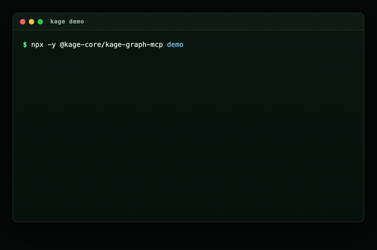

<div align="center">

# Kage

### Shared repo memory for AI coding agents

Kage gives Codex, Claude Code, Cursor, and other MCP agents the repo context
they keep forgetting: commands, decisions, bugs, conventions, code paths,
symbols, tests, and teammate knowledge.

<p>
  
  
  
  
</p>

<p>
  <a href="https://kage-core.github.io/Kage/">Website</a>
  ·
  <a href="https://kage-core.github.io/Kage/viewer/">Live viewer</a>
  ·
  <a href="https://www.npmjs.com/package/@kage-core/kage-graph-mcp">npm</a>
  ·
  <a href="#quick-start">Quick start</a>
  ·
  <a href="#how-it-works">How it works</a>
</p>



</div>

---

## Why Kage

AI coding agents are useful, but every new session starts with the same
onboarding ritual:

- Where are the important files?
- How do I run tests?
- Why was this workaround added?
- Which convention matters here?
- What broke last time?
- What did another teammate already explain?

Kage turns that repo lore into **small, reviewable memory packets** that live
with the codebase. Agents retrieve only the relevant slice for the current task
instead of rereading the whole repo or asking you to explain it again.

## What You Get

| Feature | What it does |
|---|---|
| Repo memory | Stores bugs, decisions, runbooks, gotchas, conventions, and code explanations as JSON packets |
| Code graph | Indexes files, symbols, imports, calls, routes, tests, and packages, with generic call/test signals and Python framework routes for non-TypeScript repos |
| Memory-code links | Connects repo knowledge to the files and symbols it affects |
| Decision intelligence | Shows which decisions, gotchas, runbooks, and explanations are grounded to code, plus important files still missing why-memory |
| Git intelligence | Reports risk, reviewers, contributor profiles, co-change warnings, ownership silos, and module health from local git |
| Agent bootstrap | Installs `AGENTS.md` so agents know to recall context automatically |
| Local viewer | Shows memory, code graph, decision memory, risk, module health, workspace reports, metrics, review state, and evidence |
| Review workflow | Keeps useful memory shareable while making stale or risky memory visible |

Kage is local-first. No hosted service, external database, or API key is
required.

## Quick Start

Install the CLI:

```bash
npm install -g @kage-core/kage-graph-mcp
```

Set up Codex in a repo:

```bash
cd your-repo
kage setup codex --project . --write
kage init --project .
kage setup verify-agent --agent codex --project .
```

Set up Claude Code instead:

```bash
cd your-repo
kage setup claude-code --project . --write
kage init --project .
kage setup verify-agent --agent claude-code --project .
```

Restart the agent once after setup so the MCP server reloads.

Other supported setup targets:

```bash
kage setup list
```

Kage currently prints setup for Codex, Claude Code, Cursor, Windsurf, Gemini
CLI, OpenCode, Cline, Goose, Roo Code, Kilo Code, Claude Desktop, Aider, and
generic MCP clients.

## Daily Workflow

Use your coding agent normally. Kage is meant to feel ambient, not like a
manual search tool.

| You ask | Kage helps the agent recall |
|---|---|
| `How is this repo structured?` | repo map, important paths, code graph |
| `How do I run tests?` | runbooks, commands, verified examples |
| `Fix the failing auth test.` | related bugs, files, symbols, tests |
| `Continue the work from last time.` | prior decisions, branch memory, changed paths |
| `Why is this code like this?` | rationale, gotchas, historical fixes |

Useful CLI commands:

```bash
kage recall "how do I run tests" --project .
kage code-graph "auth routes tests" --project .
kage cleanup-candidates --project . --json
kage dependency-path --project . --from src/app.ts --to src/auth.ts --json
kage module-health --project . --json
kage graph-insights --project . --json
kage workspace --project .. --json
kage workspace recall "auth header contract" --project .. --json
kage contributors --project . --json
kage decisions --project . --json
kage reviewers --project . --changed-files src/auth.ts,src/session.ts --json
kage risk --project . --targets src/auth.ts --json
kage learn --project . --learning "Use npm test after changing parser code."
kage refresh --project .
kage hook install --project .
kage pr check --project .
kage viewer --project .
```

## How It Works

Kage separates learned repo knowledge from generated code facts.

```text
repo memory packets  -> recall indexes -> memory graph
source files         -> structural map  -> code graph
task query           -> small, source-backed context result
```

Memory is stored as packets in `.agent_memory/packets/*.json`. A packet is one
durable piece of context: a bug fix, decision, convention, runbook, gotcha,
code explanation, or issue note.

Generated artifacts live beside the packets:

| Layer | Path | Purpose |
|---|---|---|
| Packets | `.agent_memory/packets/` | durable repo memory |
| Indexes | `.agent_memory/indexes/` | rebuildable recall indexes |
| Memory graph | `.agent_memory/graph/` | packet relationships, tags, paths, commands, evidence |
| Structural map | `.agent_memory/structural/` | files, symbols, imports, changed-file reuse |
| Code graph | `.agent_memory/code_graph/` | source-derived files, symbols, calls, routes, tests |
| Metrics | `.agent_memory/metrics.json` | readiness, quality, coverage, token estimates |
| Reports | `.agent_memory/reports/` | risk, contributors, decisions, module health, graph insights, workspace, quality, and benchmark JSON for the viewer |

`kage risk` uses the code graph plus local git history to show what a change
may affect: dependents, impact surface, churn, ownership, co-change partners,
ownership silos, and missing test signals. It also flags co-change partners that
are historically coupled but missing from the current change set. It is meant for
agents before touching shared or high-churn files.

`kage dependency-path` answers how two files are connected in the source graph:
whether one depends on the other, the dependency flows the other way, or they
only meet through an undirected import relationship.

`kage cleanup-candidates` reports conservative unreferenced-file candidates
with confidence and reasons. It never deletes code; cleanup still needs human
or PR review.

`kage reviewers` suggests reviewers from local git authorship, recency, and
co-change ownership for target or changed files. It does not contact GitHub or
any external service.

`kage contributors` builds local contributor profiles from git history: commits,
recent activity, touched files, touched modules, primary-owned files, ownership
silos, hotspot ownership, and commit category mix.

`kage decisions` audits why-memory coverage: decisions, gotchas, runbooks,
conventions, constraints, code explanations, weak/stale memories, and important
code paths that still have no linked decision memory.

`kage module-health` rolls code graph, test, cleanup, churn, and ownership
signals into local module scorecards for review planning.

`kage graph-insights` turns the source graph into compact architecture signals:
language parser coverage, edge mix, central files, dependency cycles, import
communities, and short entry flows. It is deterministic graph analysis, not
generated documentation.

For non-TypeScript code, the built-in generic indexer extracts symbols, imports,
bounded call edges, and test function coverage signals for common languages. SCIP,
LSP, LSIF, and tree-sitter artifacts still override generic facts when present.

`kage workspace` scans a local parent directory for sibling git repos, reports
which repos already have Kage memory, detects package dependencies and route
contract links between workspace repos, and lets agents run recall across every
indexed repo with `kage workspace recall`. It is intentionally lightweight: no
hosted database, no generated wiki, and no copied memory between repos.

`kage hook install` adds a marker-delimited git `post-commit` hook that runs
`kage refresh` and `kage pr summarize` after commits. It preserves existing hook
content, supports `KAGE_SKIP_HOOK=1`, and can be inspected or removed with
`kage hook status` and `kage hook uninstall`.

The important behavior: agents retrieve a bounded, relevant context result
instead of loading everything.
When `kage_context` receives target paths, it also includes relevant risk and
dependency-path signals in the same ambient context block.

## Viewer

Open the hosted demo:

```text
https://kage-core.github.io/Kage/viewer/
```

Open the viewer for your local repo:

```bash
kage viewer --project .
```

The local viewer auto-loads your repo memory, code graph, metrics, inbox, review
context, and repo-intelligence reports. The graph remains interactive, while the
Repo Intelligence cockpit summarizes memory-code links, decision memory, change
risk, module health, contributor profiles, graph insights, workspace coverage,
quality, and local benchmark proof.
Combined mode balances memory and code nodes so the graph stays useful instead
of turning into an unreadable file map.

## Performance

Kage is built for repeat work to scale with changed files, not the whole repo.

Current Kage-on-Kage metrics:

| Metric | Current |
|---|---:|
| Approved memory packets | 86 |
| Memory graph | 725 entities / 1,846 edges |
| Indexed code files | 22 |
| Code symbols | 2,945 |
| Tests | 100 |
| Evidence coverage | 100% |
| Readiness | 100/100 |

Why it stays fast:

- Read-only recall uses existing graph artifacts when they are fresh.
- Structural facts are reused for unchanged files.
- Generated graphs are compact and avoid duplicating structural data.
- Large generated/vendor/cache paths are ignored.
- Huge files are represented safely instead of deeply expanded.
- Recall builds lookup maps once per query instead of scanning all graph edges
  for every memory packet.

On this repo, a normal recall returns about 1,800 context tokens from roughly
197,778 indexed source tokens. The point is not just speed; it is giving the
agent the right context without dragging the whole repo into the prompt.

## Trust Model

- Repo memory is git-visible and reviewable.
- Generated indexes and graphs are rebuildable.
- Capture scans for secrets and obvious PII before writing.
- Agents can create repo-local memory.
- Org/global/shared memory promotion is explicit and human-gated.
- Public or registry content should be treated as advisory, not trusted truth.

## Development

```bash
cd mcp
npm install
npm test
```

Run the CLI from source:

```bash
npm run build --prefix mcp
node mcp/dist/cli.js viewer --project .
```

Package smoke check:

```bash
npm --prefix mcp pack --dry-run
```

## License

GPL-3.0-only. See [LICENSE](LICENSE).

Kage releases before the GPL switch were published under MIT. Future versions
are GPL-3.0-only unless a separate written commercial license says otherwise.
