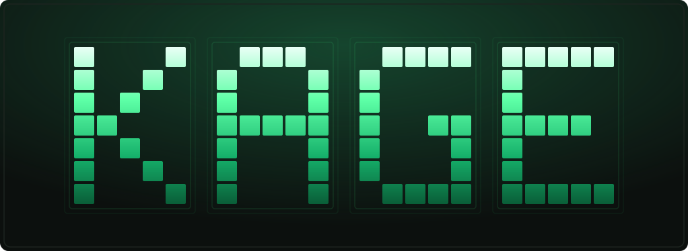
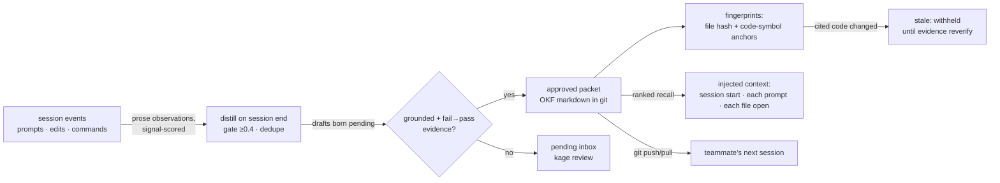

<div align="center">



In June 2026 Google shipped [**OKF (Open Knowledge Format)**](https://github.com/GoogleCloudPlatform/knowledge-catalog/tree/main/okf):
a standard for keeping knowledge as plain Markdown concept files in your repo, vendor-neutral, no
lock-in. It standardizes the store and stops there. Verification, freshness, and staleness are
explicitly *out of scope* for v0.1. **Kage is the framework that maintains it.** It captures what
your coding agents learn as a conformant OKF bundle in git, then keeps every concept honest against
your real code: a memory whose cited code no longer exists is rejected at write time, and one that
drifts when the code changes is flagged and withheld until it is re-verified. Deterministic, no LLM
on the verdict path. No account, no database, no API key.

```bash
npx -y @kage-core/kage-graph-mcp install
```

<p>
  <a href="https://www.npmjs.com/package/@kage-core/kage-graph-mcp"></a>
  <a href="https://www.npmjs.com/package/@kage-core/kage-graph-mcp"></a>
  
  
  <a href="https://github.com/GoogleCloudPlatform/knowledge-catalog/tree/main/okf"></a>
</p>

<p>
  <a href="https://kage-core.com/">Website</a> ·
  <a href="https://kage-core.com/guide.html">Docs</a> ·
  <a href="https://kage-core.com/viewer/">Live viewer</a> ·
  <a href="https://www.npmjs.com/package/@kage-core/kage-graph-mcp">npm</a>
</p>

**Works with** Claude Code · Codex · Cursor · Windsurf · Gemini CLI · Cline · Goose ·
Roo Code · Kilo Code · OpenCode · Aider · Claude Desktop · Copilot · OpenClaw · Hermes · any MCP client

</div>

---

## Install

**One command, inside your repo, then restart your agent.** That's the whole setup.

```bash
npx -y @kage-core/kage-graph-mcp install
```

It creates `.agent_memory/`, builds the code graph, writes the `AGENTS.md` / `CLAUDE.md`
policy that tells agents to use Kage, auto-detects and wires your agents, and configures
`.gitignore` + the packet merge driver. Requires Node.js 18+. No account, no API key.

**Ambient proxy — the zero-wiring path.** Two steps: install once, then `kage up`. Every
Anthropic-API agent (Claude Code, Codex CLI, aider, ...) flows through Kage with no per-agent
config at all.

```bash
npx -y @kage-core/kage-graph-mcp install   # once per repo
kage up                                    # audit-only config + runtime + foreground proxy
```

Then, in the terminal where your agent runs:

```bash
kage run -- claude       # or: export ANTHROPIC_BASE_URL=http://localhost:8788
```

`kage up` defaults to **audit mode**: measurement only — your bytes are forwarded unchanged and
nothing is injected. When you want verified memory injected into prompts, run
`kage up --mode assist`. Re-running `kage up` while the proxy is already up just reprints the
instructions and exits 0. See what it measured with `kage status --project .`.

**Or just ask your agent to set it up.** Paste this into Claude Code, Cursor, or any coding agent:

> Set up Kage (verified memory for coding agents, https://github.com/kage-core/Kage)
> in this repo: run `npx -y @kage-core/kage-graph-mcp install`, then tell me to restart you.

<details><summary>Other ways (plugin · per-agent · memory-only)</summary>

```bash
# Claude Code / Codex plugin
/plugin marketplace add kage-core/Kage      # then: /plugin install kage@kage

# wire a single agent (run `kage setup list` for all supported)
kage setup claude-code --project . --write

# memory store only, no agent wiring
kage init --project .

# confirm the harness is live
kage setup verify-agent --agent claude-code --project .
```
</details>

## What is Kage

Kage is a memory layer for coding agents. As your agent works, it captures what it learns
(decisions, bug fixes, conventions, how the code fits together) as
[**Open Knowledge Format (OKF)**](https://github.com/GoogleCloudPlatform/knowledge-catalog/tree/main/okf)
concept files committed in your repo under `.agent_memory/`. The next session (yours or a
teammate's) starts already knowing it, instead of re-reading or re-asking.

Three things make it different from other memory tools:

- **It's collaborative.** The knowledge one person (or their agent) figures out becomes the
  whole team's. Memory is shared through git, so a teammate's next session starts with what
  you just learned, not a blank slate.
- **It's standard & git-native.** Memory is a conformant OKF bundle — plain Markdown in your
  repo, reviewed in the same PR as the code, readable by any OKF tool — not locked in one
  machine or a vendor's cloud. Your knowledge stays yours.
- **It's verified.** Every memory cites the code it's about, and Kage checks those citations
  against your actual files at write time, at recall time, and when a diff changes the code.
  Memory that no longer matches the code is withheld, so the agent never acts on a stale claim.

## Kage called it. Google standardized it.

From day one, Kage kept agent memory as plain files in your repo — no cloud, no database, no
lock-in, while everyone else was building memory clouds. In June 2026, Google Cloud shipped
the **Open Knowledge Format**: knowledge as Markdown in git, vendor-neutral, no account — the
exact thesis Kage already ran on. So Kage **adopted OKF as its standard, and supercharges it**
with the layer OKF deliberately leaves out:

- **Verification** — OKF stores what you wrote down; Kage checks every concept against your
  real code and refuses hallucinated citations at write time.
- **Freshness** — OKF has no notion of staleness; Kage catches drift the moment your code
  changes and withholds memory that's no longer true.
- **Code-grounding** — a deterministic code graph anchors each concept to the exact symbols it
  describes — the layer OKF leaves to tooling.

The trust metadata rides in OKF-legal `x-kage-*` fields, so a Kage bundle stays 100%
conformant and opens in any OKF consumer, including Google's own visualizer.
**OKF standardizes the store; Kage is the verification and freshness layer Google left out.**

## How it works

Once installed, it's ambient — hooks watch the session; you don't run anything by hand.
Four paths make up the loop:



**Write path (capture).** Hooks turn the session into observations — your prompts, each
edit as prose (the edit content is where fixes and conventions live), each command with its
output. Every observation is signal-scored; machine noise hard-rejects to zero. On session
end, `distill --auto` gates (≥0.4), dedupes, and writes drafts **born pending** — never
approved by default. One thing lifts a draft to trusted recall automatically: it cites real
files, duplicates nothing, contradicts nothing, and the session contains a **fail→pass
command pair** — mechanical evidence a real fix happened. Explicit `kage_learn` writes are
refused if the cited files don't exist; secrets are scanned out.

**Trust path (verification).** Every packet fingerprints what it cites: a whole-file hash
plus anchors on the code symbols the memory actually names (real identifiers only, never
prose words). Cited code edited → soft-stale, withheld from recall until re-verified **with
evidence** (`kage reverify --evidence` — a bare re-stamp on changed code is refused). Cited
file deleted → hard-stale, withheld, garbage-collected after 30 days. "Verified" is earned
by an actual check, never granted at birth.

**Read path (recall).** Three injection moments: session start (policy + "previously…"
digest), every prompt (top verified packets + graph facts for what you asked), and every
file the agent opens or edits (packets citing that file). Ranking trusts evidence — lexical
match first, a damped graph prior that can't outvote a title match, recency decay so aged
change-logs sink, and code-graph identifier grounding so a query for `someFunction` finds
the packet citing the file that defines it. Stale memory never appears; every serve
increments a real usage counter.

**Team path (git).** The store is plain OKF markdown committed in the repo — a teammate's
clone *is* the memory transfer. A merge driver auto-resolves packet collisions (newest
content wins), and `kage pr check` gates merges: if your diff breaks what a memory claims,
you hear about it before the PR lands.

One principle threads through all four: **every number Kage shows is a count of a
reproducible check — never an estimate.**

Watch it happen in the **local dashboard** (`kage viewer`): packets, the memory↔code graph,
trust gates, and live events stream in as the agent works. Wrap anything in
`<private>…</private>` and it's never stored.

## Why Kage

Most memory tools ([claude-mem](https://github.com/thedotmack/claude-mem),
[agentmemory](https://github.com/rohitg00/agentmemory), mem0, Zep) store memory per-machine
or in a cloud you don't own, and never re-check it against the code. Kage keeps it in your
repo and verifies it, so it stays your team's and stays true as the code changes.

| | Kage | claude-mem | mem0 / Zep |
|---|---|---|---|
| Automatic capture + session-start recall | ✓ | ✓ | via SDK |
| Hallucinated citations **rejected at write time** | ✓ | — | — |
| Stale memory **withheld at recall** (cited files deleted/changed, TTL, reported) | ✓ | — | — |
| **Diff-time stale-catch**, warned before the PR when your change breaks a memory | ✓ | — | — |
| Memory reviewed in git, same PR as the code (plain files, no DB) | ✓ | SQLite + cloud | hosted API |
| Codify memory into team `SKILL.md` files agents auto-load | ✓ (`kage skills`) | — | — |
| Cross-machine sync | ✓ your own git remote | their cloud | their cloud |
| Account / API key required | none | cloud optional | yes |

## Features

- **Truth Report.** `kage scan` reads any repo in seconds and surfaces its highest-risk
  knowledge gaps: undocumented hot files, untested hot paths, complexity hotspots,
  unresolved code debt, and bus-factor-1 files, plus duplicate implementations, dead
  exports, and doc lies when they exist. Every finding cited to `file:line`. Zero setup,
  nothing generated, runs before you install anything.
- **Savings receipts.** `kage gains` keeps a per-repo value ledger (tokens + $ the agent
  didn't have to re-spend), every number traceable to a logged event; the agent relays it
  after each recall.
- **Team skills.** `kage skills` turns durable, verified procedures into
  `.claude/skills/<name>/SKILL.md` files agents auto-load, committed and shared, no cloud.
- **Personal memory & sync.** `kage learn --personal` keeps cross-machine notes in
  `~/.kage/memory`, recalled as a clearly separated lower-trust section and synced over your
  own git remote.
- **Self-healing session loop.** Uncaptured sessions are auto-distilled into pending drafts
  you review; `kage resume` opens each session with a "previously…" digest; `kage repair`
  fixes broken packets and indexes in one command.

## Benchmarks

- **LongMemEval-S retrieval:** 96.17% R@5 / 98.72% R@10, zero dependencies.
- **Memory Correctness Under Change:** 0% stale-served (memory whose code was deleted or
  changed is withheld), vs 100% for capture-everything stores.

Methodology, commands, and caveats: [docs/BENCHMARKS.md](docs/BENCHMARKS.md). Every number
above has a reproducible harness in this repo; claims without one don't ship.

## Daily commands

```bash
kage recall "how do I run tests" --project .
kage verify --project .        # check citations against current code
kage pr check --project .      # stale-catch + graph freshness gate
kage gains --project .         # what Kage saved you
kage viewer --project .        # local dashboard
kage okf migrate --project .   # render memory as a Google OKF bundle
```

Full CLI and MCP reference: [docs](https://kage-core.com/guide.html).

## Storage

Everything lives in `.agent_memory/`: `packets/` is durable repo memory (git-tracked JSON);
`graph/`, `code_graph/`, `structural/`, and `indexes/` are rebuildable with `kage refresh`;
`reports/` holds the value ledger and health reports. Capture scans for secrets and PII
before writing.

**Standard format — Open Knowledge Format (OKF).** Kage's memory is an
[OKF](https://github.com/GoogleCloudPlatform/knowledge-catalog/tree/main/okf) bundle:
plain Markdown concept files with YAML frontmatter, readable by any OKF consumer
(including Google's visualizer). Run `kage okf migrate` to render the store as an OKF
bundle under `.agent_memory/okf/`. Kage adds the lifecycle OKF leaves out — grounding,
verification, and freshness — carried in OKF-legal `x-kage-*` fields, and can `import`
any third-party OKF bundle. The round-trip is lossless. See [OKF_STANDARD.md](OKF_STANDARD.md).

## Development

```bash
cd mcp
npm install
npm test
npm run build
```

## Contributing & community

Kage is built in the open and we'd love your help. Zero runtime dependencies, no
account, no cloud — it's a friendly codebase to jump into.

- **[CONTRIBUTING.md](CONTRIBUTING.md)** — dev setup, project layout, conventions.
- **[ROADMAP.md](ROADMAP.md)** — where Kage is headed, and where to plug in.
- **[Good first issues](https://github.com/kage-core/Kage/issues?q=is%3Aissue+is%3Aopen+label%3A%22good+first+issue%22)** ·
  **[Help wanted](https://github.com/kage-core/Kage/issues?q=is%3Aissue+is%3Aopen+label%3A%22help+wanted%22)** — scoped places to start.
- **[Discussions](https://github.com/kage-core/Kage/discussions)** — questions, ideas, show-and-tell.

By participating you agree to our [Code of Conduct](CODE_OF_CONDUCT.md).

## License

GPL-3.0-only. See [LICENSE](LICENSE). Releases before the GPL switch were MIT.
