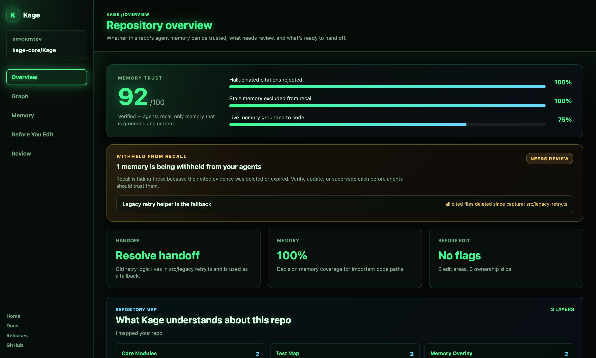

<div align="center">

# Kage

### The agent memory your team can trust and own

Every coding agent now "remembers." Kage is the memory you can **trust**: it
refuses to store hallucinated citations, withholds memory whose evidence was
deleted, and is grounded to your actual code graph — all stored as plain files
your team **reviews in the same PR as the code**. Git-native, local-first, no
API key.

Works with Codex, Claude Code, Cursor, Windsurf, and any MCP agent.

<p>
  <a href="https://kage-core.github.io/Kage/">Website</a>
  ·
  <a href="https://kage-core.github.io/Kage/guide.html">Docs</a>
  ·
  <a href="https://kage-core.github.io/Kage/viewer/">Viewer</a>
  ·
  <a href="https://www.npmjs.com/package/@kage-core/kage-graph-mcp">npm</a>
</p>

<p>
  <a href="https://www.npmjs.com/package/@kage-core/kage-graph-mcp"></a>
  <a href="https://www.npmjs.com/package/@kage-core/kage-graph-mcp"></a>
  
  
  
  
</p>


> **See it in 30 seconds — no setup, no API key:**
> ```bash
> npx -y @kage-core/kage-graph-mcp demo
> ```
> Watch Kage reject a hallucinated memory, withhold a stale one, and recall only
> grounded memory — then open the viewer.

**Works with** Claude Code · Codex · Cursor · Windsurf · Gemini CLI · Cline ·
Goose · Roo Code · Kilo Code · OpenCode · Aider · Claude Desktop · any MCP client

</div>

---



<div align="center"><sub>The viewer leads with one question: <b>can you trust this memory?</b> — trust score, and the memories recall is withholding right now.</sub></div>

## The problem

Every coding agent now remembers — and that's the danger. They confidently act on
memory that's **stale** (the file it cites was deleted last week), **hallucinated**
(it cites a file that never existed), or **ungrounded** (it has nothing to do with
your code). An agent acting on wrong memory is worse than one with none.

**Kage is the memory you can trust.** It validates citations on write, withholds
stale memory on recall, grounds everything to your code graph, and stores it as
plain files your team reviews in the same PR as the code.

## Quick start

Requires Node.js 18+. Two steps to live memory — no API key, no database.

**1. Install + initialize**
```bash
npm install -g @kage-core/kage-graph-mcp
cd your-repo
kage init --project .
```

**2. Connect your agent** (one command — auto-writes the MCP + hooks config)
```bash
kage setup claude-code --project . --write     # Claude Code
kage setup codex       --project . --write     # Codex
kage setup cursor      --project . --write     # Cursor
kage setup windsurf    --project . --write     # Windsurf
# also: gemini-cli, cline, goose, roo, kilo, opencode, aider, claude-desktop
kage setup list                                # see every supported agent
```

**Or install in one command:**
```bash
# Claude Code / Codex — plugin marketplace
/plugin marketplace add kage-core/Kage      # then: /plugin install kage@kage
codex plugin marketplace add kage-core/Kage # then: codex plugin add kage@kage

# 70+ agents — the open skills installer
npx skills add kage-core/Kage
```

Then restart the agent once and confirm it's live:
```bash
kage setup verify-agent --agent claude-code --project .
```
`verify-agent` checks the MCP server *and* the ambient prompt/tool/session hooks,
so teammates don't mistake a partial setup for live automatic memory.

## Kage vs typical agent memory

Most memory tools optimize for capturing and recalling more. The hard part is
trusting it. Here's the difference that matters when an agent *acts* on memory:

| | Typical agent memory | **Kage** |
|---|---|---|
| Hallucinated citation (file doesn't exist) | stored anyway | **rejected on write** |
| Cited file deleted / refactored | still recalled | **withheld from recall** |
| Grounded to your code graph | no | **yes — with blast radius** |
| Where memory lives | a server / vector DB | **plain files in your repo** |
| How you review it | a separate UI, if any | **in the same PR as the code** |
| Dependencies to run | embeddings / DB / API key | **none** |
| "Can I trust it?" — measurable | — | **`kage benchmark --trust` → 100/100** |

## Why Kage

Every new agent session asks the same setup questions, scans the same files,
and risks repeating the same mistakes. Kage turns that repo lore into small,
reviewable memory packets that live with the codebase. Agents retrieve only
the relevant slice for the current task instead of rereading the whole repo.

Kage is local-first. No hosted service, external database, or API key is
required for normal use.

### What makes Kage different: trust + governance

Most agent-memory tools optimize for *capturing more*. The hard problem is
trusting what's captured — an agent acting on stale or hallucinated memory is
worse than one with none. Kage is built around that:

- **Validated on write** — a memory citing files that don't exist is rejected.
- **Verified on recall** — memory whose cited files were deleted is silently
  withheld from the agent (and shown to you, never hidden).
- **Grounded to code** — memory links to the code graph; recall can return the
  bounded blast radius of what a change touches.
- **Governed like code** — packets are plain files; review, approve, and merge
  memory in the same pull request as the code it describes.

Prove it on your own repo: `kage benchmark --trust --project .` — it measures
hallucinated-citation rejection, stale-memory exclusion, and live grounding.

Numbers and how to reproduce them: [docs/BENCHMARKS.md](docs/BENCHMARKS.md)
(trust 100/100; competitive dependency-free retrieval on LongMemEval-S).

## What you get

**🛡 Trust & grounding** — write-time citation validation, recall-time staleness
exclusion, linked-file fingerprints that flag memory when its code changes,
agent reconciliation on handoff, `kage verify`, and the Suppression Shelf.

**⚡ Automatic capture** — Claude Code ambient hooks (9 lifecycle events) for
prompt-time recall, tool observation, failure capture, and session-end
distillation; observations are privacy-scanned before they're stored.

**🧭 Code intelligence** — a code graph of files, symbols, imports,
confidence-scored calls, routes (FastAPI/Flask/Django/Rails/Laravel/Spring/Go/
Rust/ASP.NET), and tests; memory↔code links; bounded blast-radius on recall.

**👥 Collaboration & lifecycle** — memory lifecycle, timeline, lineage for
superseded packets, an auditable mutation trail, a handoff queue, and local git
intelligence (risk, reviewers, co-change, ownership silos, module health).

**🖥 Surfaces** — a trust-led local **viewer** (Memory Trust score, Suppression
Shelf, code graph, memory browser, review inbox), a **daemon REST** API for
HTTP-only agents, and a full **CLI** — all on the same repo-local packets.

**🎛 Context controls** — pinned always-on context slots, memory-access tracking
(what agents actually reuse), a project-profile orientation report, and a
capability audit with evidence and next actions.

Every packet is reviewable JSON in `.agent_memory/` — version-controlled,
diffable, and reviewed in the same PR as the code it describes.

## External benchmarks

Kage includes reproducible external benchmark harnesses in
[`benchmarks/`](benchmarks/). Current LongMemEval-S retrieval result:

| System | R@5 | R@10 | R@20 | MRR | NDCG@10 |
|---|---:|---:|---:|---:|---:|
| Kage strict recall | 96.17% | 98.72% | 99.79% | 0.9094 | 0.9279 |
| Plain BM25 baseline | 96.60% | 98.09% | 99.57% | 0.9033 | 0.9215 |

This measures gold evidence retrieval, not answer-generation accuracy. See
[`benchmarks/LONGMEMEVAL.md`](benchmarks/LONGMEMEVAL.md) for methodology,
commands, and caveats. The headline run disables Kage's built-in semantic
concept expansion so the score is not based on phrase maps added after looking
at LongMemEval-style misses.

The benchmark folder also includes a synthetic memory-scale harness that
measures refresh/index time, recall latency, cross-session hit rate, and context
reduction as repo memory grows. Current local scale run: 5,000 packets indexed
in 20.7s with 373ms median recall, 100% hit rate @10, and 99.83% context
reduction versus loading all memory.

Kage also includes an early MemoryArena context-recall harness. It measures
whether Kage retrieves prior subtask answer memories for later subtasks; it is
not the official MemoryArena task-solving score. Current full 701-task
MemoryArena context-recall run across all five public splits: 99.19% average
dependency coverage and 98.79% final-step dependency coverage.

For coding-agent memory quality, Kage includes a 240-packet labeled benchmark
with runbooks, decisions, bug causes, code explanations, and hard-negative
adjacent notes. Current local result: 100% R@5/R@10, 1.0000 NDCG@10/MRR, 26ms
median recall, and 95.36% context reduction.

The local viewer also writes a benchmark proof ledger. Open `kage viewer` and
check Quality/Benchmark to see the measured result, threshold, exact command,
and next action for coding-memory retrieval, scale sanity, and repo trust gates.

Kage also writes a local sparse-vector packet index to
`.agent_memory/indexes/vector-local.json` during refresh. It keeps recall fast
and inspectable without requiring an external database or embedding service.
The lexical layer is Unicode-aware and adds CJK bigrams, so repo memory written
in Chinese, Japanese, Korean, accented Latin, or mixed code/prose remains
searchable without requiring spaces between every word.
If you want dense semantic recall, install the optional embedding package in
the same Node environment as Kage and build a local embedding artifact:

```bash
npm install -g @xenova/transformers
kage embeddings build --project .
kage recall "how do retries work?" --project . --embeddings --explain
```

Dense embeddings are opt-in because they add an optional dependency, may
download a local model, and create a larger rebuildable artifact at
`.agent_memory/indexes/embeddings-local.json`. Normal recall stays
dependency-free.

## The packet journey, and the scores

Kage stores each learning as a **packet** and moves it through a fixed lifecycle.
Every number the viewer shows comes from where packets sit in that journey.

**The journey:** capture → citation check (reject memory citing files that don't
exist) → grounding (fingerprint the cited files) → approve (git-tracked JSON) →
recall (stale memory is excluded) → `kage refresh` (re-check grounding, flag
stale, prune dead/ignored paths) → supersede or retire.

**A packet is stale** when a cited file is missing, a cited file's content changed
since it was verified, its freshness TTL (365 days) lapsed, or it was reported /
deprecated. Paths in `.kageignore` (e.g. a visualization layer) never count as
grounding and never trigger staleness — they aren't knowledge.

**Health states** (viewer Memory list + health donut):

| State | Meaning |
|---|---|
| Hot | recalled 3+ times in the last 30 days |
| Healthy | approved, grounded, non-stale, recalled at least once |
| Cold | approved and durable, but not recalled yet (or still pending) |
| Stale | a staleness condition is true — verify, update, or supersede |
| Disputed | stale and also reported / voted down |
| Ungrounded | approved but with no concrete code-path grounding |
| Generated | branch/change handoff context, not durable lore |

**Memory Trust (0–100)** is the average of three gates from
`kage benchmark --trust` — not a vanity number:

| Gate | Target | What it proves |
|---|---|---|
| Hallucinated citations rejected | 100% | won't store memory citing files that don't exist (sandbox) |
| Stale memory excluded from recall | 100% | withholds memory whose grounding was deleted (sandbox) |
| Live memory grounded to code | 80%+ | how much of *your* approved memory is grounded and current |

Gates 1–2 run in an isolated throwaway repo so the score can't be gamed; gate 3
measures your real repo, so it moves as memory drifts from or re-aligns with the
code. A fourth figure, *wrong advice prevented*, combines gates 1–2. The other
dashboard numbers — packets, tokens saved per recall, evidence coverage, average
quality, and the mapped files/symbols/routes/tests — describe the memory and the
code surface it is grounded against.

## Daily commands

```bash
kage recall "how do I run tests" --project .
kage recall "auth token validation" --project . --structural-hops 2 # + 2-hop code blast radius
kage code-graph "auth routes tests" --project .
kage verify --project . # check cited files still exist and memory isn't stale
kage compact --project . --dry-run # prune dead citations; surface duplicates to merge
kage risk --project . --targets src/auth.ts --json
kage capabilities --project . # evidence-backed memory system readiness
kage slots set --project . --label project_context --content "Always run checkout retry tests after touching retry modules." --paths src/retry.ts --tags checkout,tests
kage slots --project . --json
kage learn --project . --learning "Use npm test --prefix mcp after parser changes."
kage sessions --project . # observed sessions and distillation actions
kage replay --project . # privacy-preserving session timeline digest
kage memory-access --project . # hot/cold memories and review actions
kage memory-audit --project . # auditable memory mutations
kage handoff --project . # review queue plus distillable session learnings
kage lifecycle --project . # memory health, freshness, grounding, and feedback
kage timeline --project . # recent memory changes for handoff
kage lineage --project . # current replacements for retired memories
kage supersede --project . --packet <old-id> --replacement <new-id> --reason "why"
kage benchmark --memory-quality # coding-memory retrieval proof
kage benchmark --scale --sizes 240,1000,5000 # large-memory recall proof
kage refresh --project .
kage embeddings build --project . # optional dense local recall
kage pr check --project .
kage viewer --project .
```

For the full CLI and MCP reference, see the [docs](https://kage-core.github.io/Kage/guide.html).

## Storage

Kage writes to `.agent_memory/`. Packets are durable repo memory; everything
else is rebuildable with `kage refresh`.

| Path | Purpose |
|---|---|
| `.agent_memory/packets/` | durable repo memory (JSON, git-tracked) |
| `.agent_memory/graph/` | memory graph (rebuildable) |
| `.agent_memory/code_graph/` | source-derived code facts (rebuildable) |
| `.agent_memory/structural/` | files, symbols, imports (rebuildable) |
| `.agent_memory/slots/` | pinned repo context slots (JSON, git-trackable) |
| `.agent_memory/indexes/` | recall indexes, including optional embeddings (rebuildable) |
| `.agent_memory/audit/` | memory mutation audit trail |
| `.agent_memory/reports/` | profile, capabilities, context-slots, replay, risk, contributors, decisions, module health, workspace, quality, benchmark, handoff, lifecycle, timeline, lineage |
| `AGENTS.md` | agent harness policy |

## Trust model

- Repo memory is git-visible and reviewable.
- Capture scans for obvious secrets and PII before writing packets.
- Org / global / public promotion is explicit and human-gated.
- Public or registry content should be treated as advisory.

## Development

```bash
cd mcp
npm install
npm test
npm run build
node dist/cli.js viewer --project ..
```

## License

GPL-3.0-only. See [LICENSE](LICENSE).

Kage releases before the GPL switch were published under MIT. Future versions
are GPL-3.0-only unless a separate written commercial license says otherwise.
