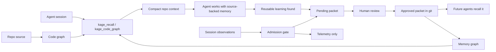

<div align="center">

# Kage

### Repo memory for coding agents

Stop rediscovering how your codebase works. Kage gives every coding agent a
reviewed repo memory, source-derived code graph, and team-shareable knowledge
base that lives with your code.

<p>
  
  
  
  
  
  
</p>

<p>
  <a href="#try-it-in-60-seconds">Quick Start</a> ·
  <a href="#proof-points">Proof</a> ·
  <a href="#works-with-your-agent">Agents</a> ·
  <a href="#why-kage">Why Kage</a> ·
  <a href="#kage-vs-alternatives">Comparison</a> ·
  <a href="#memory-review">Review</a> ·
  <a href="#visualizer">Viewer</a>
</p>

</div>

---

## What Your Agent Gets

| Before Kage | After Kage |
|---|---|
| Re-reads the same files every session | Recalls approved repo memory and code graph facts |
| Re-discovers test/build/debug commands | Finds runbooks, scripts, and source-backed workflows |
| Loses useful learnings in chat history | Captures durable learnings as pending memory packets |
| Mixes raw logs with long-term memory | Separates observations, reviewed memory, and code graph |
| Agent-specific memory silos | Shared MCP/REST memory across agents |

Kage helps agents know:

| Repo Knowledge | Source Grounding | Team Memory |
|---|---|---|
| runbooks | files | decisions |
| bug fixes | symbols | conventions |
| gotchas | imports | workflows |
| policies | calls | review state |
| references | tests | org/global artifacts |

No hosted service required. No external database. No API key. Approved memory is
plain JSON under `.agent_memory/packets/` and can be shared through git.

> AgentMemory remembers sessions. Kage makes repos and teams remember.

## Proof Points

Current local package:

| Proof | Current |
|---|---:|
| Tests | 59 passing |
| Agent setup targets | 13 |
| External DB required | 0 |
| Memory review gate | human approval |
| Code graph | files, symbols, imports, calls, routes, tests, packages |
| Retrieval | text + graph + path/type/tag + freshness + quality + feedback |
| Safety | secret/PII scan before capture |
| Sharing | git-native packets, org artifacts, public bundle artifacts |

Recent sandbox demo after building a browser game:

| Metric | Before Kage index | After Kage index |
|---|---:|---:|
| Symbols | 1 | 67 |
| Calls | 0 | 49 |
| Tests indexed | 0 | 6 |
| Estimated tokens saved per recall | 0 | 2,969 |
| Evidence coverage | 100% | 100% |

Token savings are currently estimated from indexed source and compact recall
context. Production telemetry benchmarks are a launch-track item, not something
we overclaim.

## Try It In 60 Seconds

For Codex, run this inside the repo you want Kage to remember:

```text
Set up Kage in this repo. Run the official installer:
curl -fsSL https://raw.githubusercontent.com/kage-core/Kage/master/codex-setup.sh | bash
```

Then restart Codex so the MCP server is loaded.

Ask a normal repo question:

```text
How do I run tests in this repo?
```

Or run directly:

```bash
kage recall "how do I run tests" --project /path/to/repo
kage code-graph "routes tests auth" --project /path/to/repo
kage metrics --project /path/to/repo
kage viewer --project /path/to/repo
```

The installer:

1. Clones or updates Kage under `~/.kage/Kage`.
2. Installs and builds the TypeScript MCP package.
3. Adds the local stdio MCP server to `~/.codex/config.toml`.
4. Runs `kage init --project <current-repo>`.
5. Installs or updates `AGENTS.md` so Codex uses Kage automatically.

## Works With Your Agent

Kage supports agent setup snippets for:

| Agent | Integration |
|---|---|
| Codex | MCP + repo policy installer |
| Claude Code | MCP + hook-ready observe/distill commands |
| Cursor | MCP |
| Windsurf | MCP |
| Gemini CLI | MCP |
| OpenCode | MCP |
| Cline | MCP |
| Goose | MCP |
| Roo Code | MCP |
| Kilo Code | MCP |
| Claude Desktop | MCP |
| Aider | REST via optional daemon |
| Generic MCP client | stdio MCP |

Generate config:

```bash
kage setup list
kage setup codex --project /path/to/repo --write
kage setup claude-code --project /path/to/repo
kage setup generic-mcp --project /path/to/repo
kage setup doctor --project /path/to/repo
```

## Why Kage

Every new agent session starts half-blind. It rereads files, rediscovers
commands, repeats old mistakes, and loses useful learnings into chat history.

Kage changes that loop:

```text
Session 1:
  Agent discovers a workflow, bug fix, convention, or gotcha.
  Kage stores it as a pending memory packet.
  A human reviews and approves it.

Session 2:
  Any agent recalls the approved memory and code graph.
  It starts with source-backed repo context instead of rediscovering.
```

Kage keeps three things separate:

- Code graph: rebuilt from source files and index artifacts.
- Memory graph: built from reviewed memory packets.
- Observations: raw local evidence, not durable memory.

That separation is the product. Kage does not turn every session log into a
junk graph.

## How It Works



| Layer | Stored As | Used For |
|---|---|---|
| Code graph | `.agent_memory/code_graph/*.json` | files, symbols, imports, calls, routes, tests |
| Approved memory | `.agent_memory/packets/*.json` | runbooks, decisions, gotchas, bug fixes, conventions |
| Pending memory | `.agent_memory/pending/*.json` | review queue before team sharing |
| Observations | `.agent_memory/observations/*.json` | local evidence and distillation input |
| Org/global artifacts | `.agent_memory/orgs/`, `.agent_memory/global-cdn/` | review-gated sharing beyond one repo |

## Kage Vs Alternatives

| Capability | Kage | AgentMemory-style session memory | Built-in files like `CLAUDE.md` |
|---|---|---|---|
| Primary job | repo/team memory | session capture | static notes |
| Source graph | yes, source-derived code graph | not the core surface | no |
| Memory approval | human-gated packets | mostly automatic lifecycle | manual editing |
| Team sharing | git-native approved packets | shared server/runtime | copy files |
| Agent portability | MCP + REST + setup matrix | MCP + REST + hooks | per-agent |
| Junk prevention | admission gate + review | lifecycle/decay | manual pruning |
| Org/global path | local artifacts now, hosted later | memory server/team namespace | no |
| Best use | trusted repo knowledge | remembering what happened | small instructions |

The sharp distinction:

```text
Session memory answers: what happened?
Kage repo memory answers: what should future agents know before acting?
```

## Known Beta Limits

Kage is ready for local-first beta and customer pilots. These are the limits to
be clear about:

- Token savings are estimated, not production-measured telemetry yet.
- Viewer review can inspect pending memory; CLI is still the approval path.
- Ambient behavior depends on each agent respecting repo policy or hooks.
- Org/global are local artifact modes, not hosted SaaS yet.
- Marketplace recommendations never auto-install skills, docs, or MCP servers.
- Public bundle generation does not publish to a real CDN.

## What Ships Today

- Repo-local memory packets in `.agent_memory/packets/*.json`.
- Pending memory capture in `.agent_memory/pending/*.json`.
- Human review before memory becomes approved and shareable.
- Generated indexes in `.agent_memory/indexes/`.
- Evidence-backed memory graph in `.agent_memory/graph/`.
- Source-derived code graph in `.agent_memory/code_graph/`.
- Multi-language code indexing with built-in static extractors.
- Optional ingestion of Tree-sitter, SCIP, LSIF, and LSP artifacts.
- MCP tools for recall, graph query, metrics, learning, validation, and branch
  review summaries.
- Optional local daemon with REST endpoints for observe, recall, distill,
  metrics, quality, and benchmark.
- Memory admission scoring so routine session events do not become durable
  memory.
- Hybrid recall explanations across text, graph, path/type/tag, freshness,
  quality, and feedback scoring.
- Agent policy installation through `AGENTS.md` so Kage is used automatically.
- Local terminal-style graph viewer for demos and memory inspection.
- Local org-memory inbox, review, audit, registry export, and org recall.
- Static global/CDN bundle generation for human-promoted public candidates.
- Marketplace manifest and install plan for docs, skills, and MCP packs.

## Product Model

Kage has three layers:

| Layer | Status | Purpose |
|---|---:|---|
| Local repo memory | Ships now | Private, git-native memory for one repo. |
| Org memory | Local artifact mode ships now | Review-gated memory shared across teams through exported org registries. Hosted sync is optional. |
| Global graph/CDN | Local artifact mode ships now | Static public-review bundles, marketplace manifests, revocation files, and rollback aliases. Real CDN upload is optional. |

The local layer is the default. Org/global commands write deterministic local
artifacts first. A memory server or hosted CDN is only needed when sharing scope
exceeds git/filesystem distribution.

## Install From Source

Local development install:

```bash
git clone https://github.com/kage-core/Kage.git
cd Kage/mcp
npm install
npm run build

../codex-setup.sh --project /path/to/your/repo
```

## Install For Any MCP Client

Build the MCP package:

```bash
cd mcp
npm install
npm run build
```

Configure your client with the stdio server:

```json
{
  "mcpServers": {
    "kage": {
      "command": "node",
      "args": ["/absolute/path/to/Kage/mcp/dist/index.js"]
    }
  }
}
```

Then initialize a repo:

```bash
kage init --project /path/to/repo
```

## Core CLI

```bash
kage setup list
kage setup codex --project /path/to/repo --write
kage setup claude-code --project /path/to/repo
kage setup generic-mcp --project /path/to/repo
kage setup doctor --project /path/to/repo

# First-run setup
kage init --project /path/to/repo
kage policy --project /path/to/repo
kage doctor --project /path/to/repo

# Build and inspect repo knowledge
kage index --project /path/to/repo
kage recall "how do I run tests" --project /path/to/repo
kage recall "how do I run tests" --project /path/to/repo --explain --json
kage graph "test command" --project /path/to/repo
kage code-graph "routes and tests" --project /path/to/repo
kage metrics --project /path/to/repo
kage quality --project /path/to/repo
kage benchmark --project /path/to/repo
kage viewer --project /path/to/repo

# Optional live runtime
kage daemon start --project /path/to/repo
kage daemon status --project /path/to/repo
kage observe --project /path/to/repo --event '{"type":"command_result","session_id":"s1","command":"npm test","exit_code":0}'
kage distill --project /path/to/repo --session s1

# Capture and review memory
kage learn --project /path/to/repo --learning "Decision: run tests with npm test from mcp/"
kage capture --project /path/to/repo --type runbook --title "Run tests" --body "Use npm test in mcp/."
kage review-artifact --project /path/to/repo
kage review --project /path/to/repo
kage validate --project /path/to/repo

# Branch and sharing helpers
kage propose --project /path/to/repo --from-diff
kage feedback --project /path/to/repo --packet <packet-id> --kind helpful
kage registry --project /path/to/repo
kage marketplace --project /path/to/repo
kage promote --project /path/to/repo --public <approved-packet-id>
kage export-public --project /path/to/repo

# Org and global artifact mode
kage org upload --project /path/to/repo --org acme --packet <approved-packet-id>
kage org status --project /path/to/repo --org acme
kage org review --project /path/to/repo --org acme --packet <org-packet-id> --approve
kage org recall "how do I run tests" --project /path/to/repo --org acme
kage org export --project /path/to/repo --org acme
kage layered-recall "how do I run tests" --project /path/to/repo --org acme --global
kage global build --project /path/to/repo --org acme
```

## MCP Tools

Local repo tools:

- `kage_recall`
- `kage_code_graph`
- `kage_metrics`
- `kage_quality`
- `kage_benchmark`
- `kage_setup_agent`
- `kage_graph`
- `kage_graph_visual`
- `kage_learn`
- `kage_capture`
- `kage_observe`
- `kage_distill`
- `kage_feedback`
- `kage_install_policy`
- `kage_branch_overlay`
- `kage_validate`
- `kage_registry_recommend`
- `kage_marketplace`
- `kage_org_status`
- `kage_org_upload_candidate`
- `kage_org_recall`
- `kage_layered_recall`
- `kage_global_build`
- `kage_review_artifact`
- `kage_propose_from_diff`
- `kage_promote_public_candidate`
- `kage_export_public_bundle`

Public graph tools:

- `kage_search`
- `kage_fetch`
- `kage_list_domains`

## Automatic Agent Behavior

Kage becomes ambient through the `AGENTS.md` policy installed by `kage init` or
`kage policy`.

For normal coding tasks, the agent should:

1. Call `kage_validate`.
2. Call `kage_recall` with the user task.
3. Call `kage_graph` or `kage_code_graph` when source flow matters.
4. Use returned memory only when relevant and source-backed.
5. Capture reusable learnings with `kage_learn`.
6. Call `kage_propose_from_diff` before final response when files changed.
7. Never approve, publish, or install shared assets automatically.

The user should not have to manually ask for recall or memory capture during
normal work. The harness tells the agent when to use the tools. Where an agent
supports hooks or lifecycle events, those hooks can call `kage observe` and
`kage distill`; where it only supports MCP, the installed policy and MCP tools
provide ambient recall and capture.

## Memory Review

Memory is intentionally human-gated.

```text
agent learns something
  -> kage_learn, kage_capture, or kage observe + kage distill
  -> .agent_memory/pending/*.json
  -> kage review-artifact
  -> kage review
  -> .agent_memory/packets/*.json
  -> kage index
  -> recallable by future agents
```

`kage review-artifact` writes `.agent_memory/review/memory-review.md` with
quality notes, duplicate candidates, risks, and estimated token savings. `kage
review` is the CLI approval gate. Approved packets are committed like normal
repo files and shared with teammates through git.

Kage does not turn every observation into memory. Observations are the raw
session trail; memory packets are the small set of durable repo learnings that a
future agent should act on.

The admission gate blocks low-value candidates before they enter review:

- routine commands already discoverable from manifests
- file touched/edited/changed events with no reusable conclusion
- raw user task prompts
- transcript summaries without a decision, root cause, gotcha, or workflow
- generic framework knowledge that belongs in public docs, not repo memory
- duplicates of existing packets or generated code graph facts
- anything that trips the privacy scanner

Good memory has a future trigger and a source-backed action: "when this test
fails, check this fixture", "before changing auth, update this policy", "run
this non-obvious command from this directory", or "this decision was made
because...".

The detailed admission model is documented in
[docs/MEMORY_ADMISSION.md](docs/MEMORY_ADMISSION.md).

## What Gets Stored

Kage stores future-useful knowledge, not transcripts:

- repo maps
- runbooks
- bug fixes
- decisions
- conventions
- workflows
- gotchas
- references
- policies

Each packet includes schema version, title, summary, body, type, scope,
visibility, sensitivity, status, confidence, tags, paths, stack, source refs,
freshness, graph edges, quality fields, and timestamps.

Packet quality includes an admission result: score, class, reasons, risks, and
an estimated review cost. The review artifact surfaces those fields so a human
can approve strong memories quickly and reject weak ones without opening every
JSON file.

Generated indexes and graphs are disposable. The canonical memory is the packet
set.

Raw observations are different from approved memory. Observations are local
runtime/session records under `.agent_memory/observations/`, privacy-scanned and
deduplicated before storage. Distillation converts them into pending packets
with `source_refs.kind = "observation_session"`. They are never approved or
published automatically.

In other words: "session touched 1 path" is telemetry, not memory. It can help
audit a session or replay what happened, but it should not become a recallable
repo graph node unless distillation extracts a reusable learning from it.

## Code Graph

Kage keeps learned memory and codebase structure separate, then recalls across
both.

- The code graph is rebuilt from source and external index artifacts.
- The memory graph is built from approved packets only.
- Observations are local evidence and session replay data.

That separation keeps the graph useful: code flow comes from the repository,
durable lessons come from reviewed packet memory, and raw events do not pollute
future recall.

The code graph writes:

- `files.json`
- `symbols.json`
- `imports.json`
- `calls.json`
- `routes.json`
- `tests.json`
- `packages.json`
- `graph.json`

Built-in indexers cover JS/TS plus deterministic static extraction for Python,
Go, Rust, Java, Kotlin, Ruby, PHP, C#, C/C++, Swift, and common manifests.

For stronger code intelligence, Kage also ingests external artifacts:

- `.agent_memory/code_index/tree-sitter.json`
- `.agent_memory/code_index/scip.json`
- `.agent_memory/code_index/lsp-symbols.json`
- `.agent_memory/code_index/lsif.jsonl`
- `tree-sitter-index.json`
- `index.scip.json`
- `dump.lsif`

Those artifacts enrich the graph without making heavyweight parsers mandatory
for every install.

## Visualizer

The terminal graph viewer is zero-dependency and local. The preferred launch
path is:

```bash
kage viewer --project /path/to/repo
```

That starts a localhost viewer server, serves the project graph/code/metrics and
review files, and prints a URL that auto-loads the full console. You should not
need to manually select JSON for normal use.

Static/manual mode is still available:

```text
mcp/viewer/index.html?graph=/repo/.agent_memory/graph/graph.json&code=/repo/.agent_memory/code_graph/graph.json&metrics=/repo/.agent_memory/metrics.json
```

It supports memory/code/combined views, search, type and relation filters,
click-to-inspect nodes and edges, review risk markers, review queue inspection,
quality/proof metrics, estimated tokens saved, drag-to-pan, wheel zoom, and fit
controls.

## Safety Model

- Local repo memory is private by default.
- Generated public candidates are local files only.
- Nothing is published to org or global memory automatically.
- Registry recommendations do not auto-install skills, docs, or MCP servers.
- Org upload creates a review candidate; it does not approve org memory.
- Global build uses only human-promoted public candidates and writes local CDN
  artifacts; it does not upload to a hosted service.
- Capture blocks obvious secrets, tokens, private URL credentials, bearer
  tokens, private keys, and email addresses before writing packets.
- Public/global content is advisory and lower priority than repo-local memory.

## Org, Global, And Marketplace

Kage now ships org/global as local artifact mode:

- Org memory lives under `.agent_memory/orgs/<org>/`.
- Org uploads land in `inbox/` and require `kage org review --approve` before
  org recall can use them.
- Org review writes an audit log and exports `registry.json`.
- Public candidates live under `.agent_memory/public-candidates/` and are built
  into `.agent_memory/public-bundle/`.
- `kage global build` writes `.agent_memory/global-cdn/registry.json`,
  immutable registry snapshots, `latest.json`, and `revocations.json`.
- `kage marketplace` writes `.agent_memory/marketplace/manifest.json` and an
  explicit `install-plan.md` for docs, skills, and MCP packs.

Priority is always:

```text
branch > repo local > org > global
```

Repo-local memory wins unless the user or installed policy explicitly expands
scope with org/global recall.

## Hosted Roadmap

Customer-facing beta guidance lives in
[docs/CUSTOMER_READINESS.md](docs/CUSTOMER_READINESS.md). It includes
positioning, target customers, demo script, proof metrics, onboarding flow,
known beta gaps, and support runbook.

The hosted roadmap lives in [docs/ORG_GLOBAL_ROADMAP.md](docs/ORG_GLOBAL_ROADMAP.md).
It covers org memory, permissions, branch overlays, PR bot, registry signing,
global CDN publish, and operational launch gates.

These hosted pieces are optional transport and operations extensions. The local
artifact mode is the source-of-truth workflow that hosted services should sync,
sign, serve, and audit.

## Development

```bash
cd mcp
npm install
npm test
```

The current package test suite covers packet validation, migration, indexing,
recall ranking, code graph building, external code-index artifact ingestion,
metrics, MCP behavior, graph export, review artifacts, branch proposals,
registry recommendations, org memory review, layered recall, marketplace
manifests, global/CDN bundle generation, and public bundle sanitization.
