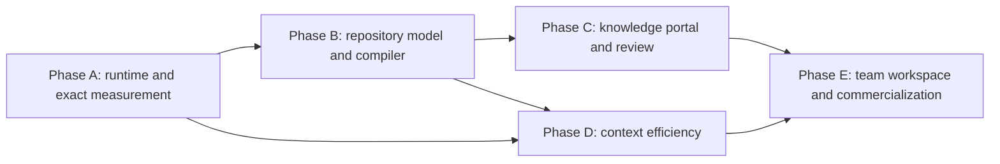

# Kage vNext Program Implementation Plan

> **For agentic workers:** REQUIRED SUB-SKILL: Use superpowers:subagent-driven-development (recommended) or superpowers:executing-plans to implement this plan task-by-task. Steps use checkbox (`- [ ]`) syntax for tracking.

**Goal:** Deliver Kage as a local-first, collaborative repository-intelligence and automatic agent-context platform that proves it improves outcomes without increasing unmeasured context cost.

**Architecture:** Use a strangler migration around the existing TypeScript package. New work lands in bounded `mcp/vnext/` modules behind versioned protocols, while `mcp/daemon.ts`, `mcp/proxy.ts`, `mcp/cli.ts`, `mcp/index.ts`, and `mcp/kernel.ts` become compatibility adapters. A React knowledge portal consumes the same local/workspace APIs; the hosted workspace adds PostgreSQL, identity, review, GitHub, billing, and enterprise controls only after local value is proven.

**Tech Stack:** TypeScript, Node.js, `node:http`, `node:sqlite` for the Node 22.5+ vNext local runtime, existing Node test runner, React with TypeScript and Vite for the portal, Playwright for browser acceptance, PostgreSQL for the team workspace, GitHub Apps, Stripe Billing/Entitlements, OKF, and Git.

---

## Source of truth

Implement against:

- `docs/superpowers/specs/2026-07-13-kage-collaborative-repository-intelligence-design.md`

When a phase plan and the specification differ, stop and update both documents before code changes. Do not silently change the product boundary during implementation.

## Why this is a program, not one branch

The approved specification contains five independently risky systems:

1. A persistent local runtime and adapter protocol.
2. A canonical repository model and knowledge compiler.
3. A human knowledge and review portal.
4. A reversible context gateway and minimal-change policy engine.
5. A multi-tenant workspace, GitHub integration, security plane, and commercial system.

Each system must produce working, testable software before the next one depends on it. A single long-running branch would hide failures, make rollback impractical, and force the UI, cloud, and billing work to depend on schemas that have not survived real local use.

## Phase plans

Execute these plans in order unless the dependency graph explicitly permits overlap:

1. [Phase A — Local Runtime and Measurement](./2026-07-13-kage-vnext-phase-a-runtime-measurement.md)
2. [Phase B — Repository Model and Knowledge Compiler](./2026-07-13-kage-vnext-phase-b-repository-model-compiler.md)
3. [Phase C — Knowledge Portal and Review](./2026-07-13-kage-vnext-phase-c-knowledge-portal.md)
4. [Phase D — Context Budget Engine and Minimal Change Guard](./2026-07-13-kage-vnext-phase-d-context-efficiency.md)
5. [Phase E — Team Workspace and Commercialization](./2026-07-13-kage-vnext-phase-e-team-commercial.md)

Phase C may begin after Phase B's schema, repository read model, and review-item API are stable. Phase D may begin after Phase A receipts and Phase B context-source interfaces are stable. Phase E may begin only after Phases B–D pass their pilot gates.

## Specification coverage matrix

| Approved design area | Implementation owner |
|---|---|
| Product boundary, target customer, principles and hybrid architecture | Master program and every phase gate |
| Canonical entity/claim/evidence/relation model and trust states | Phase B Tasks 1–2 |
| Automatic local runtime, adapter protocol and injection moments | Phase A Tasks 1–5 |
| Knowledge compiler, admission, model-assisted proposals, consolidation and staleness | Phase B Tasks 3–8 |
| Packet migration and OKF portability | Phase B Task 9 |
| Model-backed context composition | Phase B Task 10 |
| Context Budget Engine, reversible compression and retrieval | Phase D Tasks 1–7 |
| Agent-surface capability truth, including Codex fallback boundaries | Phase D Task 6 |
| Minimal Change Guard preflight, post-diff and PR behavior | Phase D Tasks 8–10 |
| Human portal, overview, maps, feature/runbook/decision pages | Phase C Tasks 1–6 |
| Review queue and human authority | Phase C Task 7 and Phase E Task 4 |
| Task receipts, exact metrics and visible ROI | Phase A Tasks 6–8, Phase C Task 8, Phase E Task 6 |
| Reliability, fail-open behavior, health and backpressure | Phase A Tasks 2–8 and Phase D Tasks 3–5 |
| Security, privacy and permission-aware knowledge | Phase A local token boundary, Phase B trust, Phase E Tasks 1–9 |
| Local, managed and self-hosted deployment modes | Phase A, Phase E Tasks 1 and 9 |
| Pricing, no-overhead trial and monetization | Phase E Tasks 6–7 and 10 |
| GitHub distribution and adoption | Phase E Task 5 and design-partner pilot |
| Tool simplification and legacy migration | Phase B Task 9, Phase D Task 7, Phase E Task 10 and v4/v5 release sequence |
| Testing, validation, risks and kill criteria | Per-task TDD, phase gates and master GA decision |

The self-review found no approved design area without an implementation owner. Third-party agent surfaces are capability-tested rather than assumed: Codex automatic telemetry does not count as automatic context injection while its integration remains plugin/MCP fallback.



## Runtime compatibility decision

The published package currently declares Node 18+ support, while `node:sqlite` was added in Node 22.5 and the current cloud server already gates that one feature dynamically. Preserve this boundary during migration:

- Legacy MCP, CLI, OKF, scan, check, and recall paths continue loading on Node 18+ through Phase D.
- The new `kaged` runtime and workspace-development commands perform a runtime check and require Node 22.5+.
- No top-level eager `node:sqlite` import is allowed in a module loaded by the Node 18 CLI path.
- CI runs the legacy load smoke test on Node 18 and the complete vNext suite on the repository's supported Node 22 line.
- The package-wide engine can move to a maintained Node 22+ baseline only at the Phase E GA gate, with a major-version release and migration notice.

The Node documentation records `node:sqlite` as added in 22.5.0, which is the basis for this boundary: <https://nodejs.org/api/sqlite.html>.

## Target repository layout

The implementation uses a strangler directory rather than moving the current product immediately:

```text
mcp/
  vnext/
    protocol/          versioned events, capsules, receipts, sync messages
    runtime/           process lifecycle, local API, auth, paths, health
    storage/           SQLite boundary, migrations, event and receipt stores
    adapters/          Claude hook, proxy, MCP fallback, adapter client
    repo-index/        legacy graph adapter and incremental repository scanner
    repo-model/        entities, claims, evidence, relations and repositories
    compiler/          episodes, extraction, resolution, verification, consolidation
    context/           task interpretation, retrieval, trust filter and composition
    gateway/           content store, compressors, budgets and request transforms
    policy/            Minimal Change Guard preflight and post-diff rules
    api/               local/workspace read models and HTTP route handlers
    sync/              outbox, replication, conflict handling and permissions
    workspace/         PostgreSQL service, identity, review, metrics and billing
    migration/         packet import, compatibility reports and cutover helpers
    index.ts            supported vNext library exports only
platform/
  web/                 React/Vite knowledge portal
  e2e/                 Playwright fixtures and user-journey tests
deploy/
  workspace/           container, environment, migration and backup assets
docs/
  migration/           administrator and user migration guides
```

No new product logic is added to `mcp/kernel.ts`. Existing functions may be wrapped, moved with tests, or delegated to, but vNext modules cannot import the whole kernel as an untyped service locator.

## Cross-phase protocol rules

The Phase A protocol is the compatibility spine for the whole program:

```ts
export const KAGE_PROTOCOL_VERSION = 1 as const;

export type MeasurementQuality = "exact" | "partial" | "unavailable";
export type TrustState = "proposed" | "verified" | "approved" | "disputed" | "stale" | "superseded" | "archived";
export type PrivacyClass = "local_raw" | "team_metadata" | "team_approved";

export interface RepositoryIdentity {
  repo_id: string;
  root: string;
  remote: string | null;
  branch: string | null;
  commit: string | null;
  worktree: string;
}

export interface TaskIdentity {
  task_id: string;
  session_id: string;
  user_id: string | null;
  agent_surface: string;
}
```

All later plans reuse these names. Renaming one requires a protocol migration and updates to every phase plan before implementation continues.

## Feature flags and cutover

Use explicit repository configuration under `.agent_memory/config.json`:

```json
{
  "vnext": {
    "runtime": "audit",
    "context_source": "legacy",
    "compiler": "shadow",
    "portal": "off",
    "gateway": "audit",
    "minimal_change": "off",
    "team_sync": "off"
  }
}
```

Allowed progression:

```text
runtime: off -> audit -> assist
context_source: legacy -> compare -> model
compiler: off -> shadow -> active
portal: off -> local -> team
gateway: off -> audit -> assist -> protect
minimal_change: off -> advisory -> pr_warning -> enforced
team_sync: off -> metadata -> approved_evidence
```

Rollback always moves a flag one state to the left. Data migrations must be forward-only, but old readers remain able to ignore vNext tables and files.

## CI matrix

The final program requires these jobs:

| Job | Runtime | Command | Purpose |
|---|---|---|---|
| Legacy load | Node 18 | `node mcp/dist/cli.js help` | Prove eager vNext imports did not break the current package |
| MCP regression | Node 22 | `npm test --prefix mcp` | Existing and vNext unit/integration suite |
| Protocol compatibility | Node 22 | `node --test mcp/dist/vnext/protocol/**/*.test.js` | Frozen fixture and migration compatibility |
| Portal unit | Node 22 | `npm test --prefix platform/web` | React read-model behavior and accessibility |
| Portal browser | Node 22 | `npm run test:e2e --prefix platform/web` | User journeys in Chromium; WebKit/Firefox nightly |
| Workspace integration | Node 22 + PostgreSQL | `npm run test:workspace --prefix mcp` | Tenant, sync, review and billing boundaries |
| Security | Node 22 + PostgreSQL | `npm run test:security --prefix mcp` | Tenant isolation, secrets, signatures and authorization |
| Kage PR | Node 22 | existing refresh and `pr check` flow | Memory and graph reconciliation |

## Commit and review boundaries

Every numbered task in a phase plan ends with a commit. Do not combine tasks simply because they touch the same directory. Each commit must:

- Start from passing tests.
- Add a failing test before the implementation.
- Preserve legacy behavior unless the task explicitly performs a flagged cutover.
- Run the task's focused test and the phase regression command.
- Run `kage_refresh` after meaningful source changes.
- Update or supersede affected Kage memory.
- Run `kage_propose_from_diff` or `kage pr summarize`, then `kage_pr_check` before review.

## Program gates

### Gate A — attachment and measurement

- Two automatic integration paths work without an MCP recall call.
- Daemon outage leaves the agent request unchanged.
- Every eligible task has a delivery receipt.
- Exact, partial, and unavailable measurements are visibly distinct.
- No savings estimate is presented as exact.

### Gate B — repository truth

- Real repositories produce navigable feature, component, flow, decision, and runbook entities.
- High-impact claims cannot become trusted without authorized review.
- New evidence consolidates into current entities rather than producing duplicate notes.
- Existing packets import without losing content, status, attribution, or identifiers.
- The model context source matches or beats legacy retrieval on the frozen evaluation set.

### Gate C — human usefulness

- A developer can answer common feature and runbook questions without opening packet files.
- Every metric exposes its formula and source records.
- Reviewers can accept, edit, reject, supersede, assign, or request evidence.
- Graph views have keyboard-accessible table equivalents.
- The portal passes the end-to-end onboarding, review, receipt, and runbook journeys.

### Gate D — efficiency and minimalism

- Lossy compression is always reversible.
- The gateway meets the p95 latency budget on the target repository cohort.
- The enabled cohort reaches the specified p50 provider-input cost reduction.
- Protect mode automatically stops transformations that violate cost or latency limits.
- Model-only Minimal Change Guard findings never block a merge.
- Deterministic enforced rules have individually tested escape and justification paths.
- Automatic attachment is transcript-certified on three surfaces: Claude Code hooks, one proxy-compatible agent, and a Cursor version whose session-start injection passes the certification fixture. Codex remains automatic capture plus MCP fallback until it passes the same injection test.

### Gate E — commercial readiness

- Permission-aware synchronization passes cross-tenant and restricted-path tests.
- GitHub App permissions are least-privilege and webhook signatures are verified.
- Billing webhooks are idempotent and entitlements are server-enforced.
- Backup, restore, export, delete, retention, and audit procedures are exercised.
- Three design partners finish measured pilots and at least one converts to a paid team plan.
- The no-overhead pilot report distinguishes exact request savings from cohort outcome trends.

## Release sequence

| Release | Default behavior | Audience |
|---|---|---|
| `3.x` experimental | vNext flags off; legacy product unchanged | Contributors and local dogfood |
| `3.x` audit preview | runtime and gateway audit available by explicit opt-in | Design partners |
| `4.0-beta` | new runtime, model and local portal available; legacy compatibility on | Pilot teams |
| `4.0-rc` | team workspace and GitHub integration available; migration tooling required | Paid design partners |
| `4.0` | automatic context and model source default for new installs; legacy reader retained | General availability |
| `5.0` | deprecated legacy tools and packet-operational paths removed after telemetry confirms safe migration | Mature deployments |

## Rollback rules

1. Never delete legacy packet files during Phases A–D.
2. Model migrations record `legacy_packet_id` and source fingerprint for reversible audits.
3. The local daemon keeps an append-only migration journal.
4. Team sync never changes a local trusted claim without preserving the previous version.
5. Gateway failure forwards the original request bytes.
6. Portal failure does not affect context delivery.
7. Workspace failure uses the last verified local replica.
8. Billing failure denies paid-only hosted features but never blocks export or local operation.

## Program-level verification commands

Run after every applicable phase gate. The MCP suite applies from Phase A onward; portal commands begin in Phase C; workspace commands begin in Phase E:

```bash
npm test --prefix mcp
```

From Phase C onward also run:

```bash
npm test --prefix platform/web
npm run test:e2e --prefix platform/web
```

After any meaningful repository change run:

```bash
node mcp/dist/cli.js refresh --project . --json
node mcp/dist/cli.js pr check --project . --json
```

Expected result: every command exits `0`; Kage reports current code and memory graphs; no newly changed trusted memory remains unreconciled.

## Program execution checklist

- [ ] **Step 1: Execute Phase A plan and approve Gate A**

Use `docs/superpowers/plans/2026-07-13-kage-vnext-phase-a-runtime-measurement.md`.

- [ ] **Step 2: Run a seven-day internal audit-mode dogfood period**

Collect attachment reliability, measurement quality, daemon latency, and failures. Do not enable prompt transformation during this period.

- [ ] **Step 3: Execute Phase B plan and approve Gate B**

Use `docs/superpowers/plans/2026-07-13-kage-vnext-phase-b-repository-model-compiler.md`.

- [ ] **Step 4: Freeze repository-model API version 1**

Create a signed fixture export and require later phases to pass it unchanged:

```bash
node mcp/dist/cli.js model export-fixture --project . --out mcp/vnext/fixtures/model-v1.json
git add mcp/vnext/fixtures/model-v1.json
git commit -m "test: freeze repository model v1 fixture"
```

- [ ] **Step 5: Execute Phase C plan and approve Gate C**

Use `docs/superpowers/plans/2026-07-13-kage-vnext-phase-c-knowledge-portal.md`.

- [ ] **Step 6: Execute Phase D plan and approve Gate D**

Use `docs/superpowers/plans/2026-07-13-kage-vnext-phase-d-context-efficiency.md`.

- [ ] **Step 7: Run the first measured local pilot cohort**

Use at least 30 tool-heavy tasks across at least three repositories. Store exact request transformation receipts and separately store cohort outcomes. Stop the rollout if p50 net provider-input savings is below the approved gate or if verification success regresses.

- [ ] **Step 8: Execute Phase E plan and approve Gate E**

Use `docs/superpowers/plans/2026-07-13-kage-vnext-phase-e-team-commercial.md`.

- [ ] **Step 9: Publish the major-version migration release candidate**

Run:

```bash
npm test --prefix mcp
npm test --prefix platform/web
npm run test:e2e --prefix platform/web
node mcp/dist/cli.js migrate plan --project . --json
node mcp/dist/cli.js pr check --project . --json
```

Expected: all tests pass; migration planning is non-mutating and reports every legacy packet; PR check passes.

- [ ] **Step 10: Make the GA decision from measured evidence**

Approve GA only when all five program gates pass, the pilot report is reproducible, no critical security issue remains open, backup/restore has been exercised, and a design partner has accepted paid terms.
