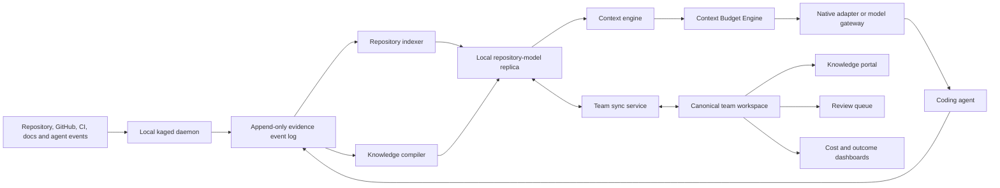

# Kage Collaborative Repository Intelligence — Product and Architecture Design

**Date:** 2026-07-13

**Status:** Written specification approved for implementation planning

**Scope:** Kage vNext product reset and staged migration
**Initial market:** Engineering teams of 5–50 developers working in one repository or monorepo with two or more coding-agent surfaces

## 1. Executive summary

Kage will stop presenting itself as a collection of memory tools. It will become the collaborative repository-intelligence and context-control plane for coding agents.

The product promise is:

> Kage makes every coding agent understand the repository like an experienced teammate, while consuming less context, producing smaller changes, and preserving what the team learns.

Kage vNext combines three capabilities that reinforce one another:

1. A living, evidence-backed repository model of features, components, flows, contracts, decisions, runbooks, incidents, dependencies, and ownership.
2. An automatic context plane that attaches the right repository knowledge to an agent without relying on the agent to remember an MCP call.
3. An efficiency gateway that measures its own cost, compresses low-value context reversibly, and encourages the smallest repository-native change.

The commercial requirement is explicit: Kage must be able to prove that it improves agent outcomes without becoming an unmeasured token and infrastructure tax. Each task therefore receives a value receipt with exact context additions, exact compression transformations, Kage processing cost, latency, sources used, verification outcomes, and knowledge updates.

This document is an umbrella product specification. The program is too large for a single safe implementation unit, so it is decomposed into separately gated subprojects. The complete implementation program is documented as a master plan plus five phase plans; execution still begins with the local runtime, integration protocol, event log, audit mode, and exact cost measurement. Every later phase is revalidated against the preceding phase gate before implementation.

## 2. Evidence from the current product

The design responds to observed problems in the repository rather than an abstract memory-market thesis.

The current implementation has:

- A `mcp/kernel.ts` file of more than 22,000 lines with many unrelated responsibilities.
- Seventy-two MCP tool schemas in full mode and a much larger CLI surface than users can reasonably understand.
- Hundreds of Markdown packet files, with most active packets never recalled.
- Quality scoring that frequently saturates at 100 and cannot reliably distinguish useful repository knowledge from verbose captures.
- Retrieval that often surfaces implementation history when the task calls for the current architecture or procedure.
- Git-native packet collaboration without shared operational telemetry such as usage, misses, context deliveries, or task outcomes.
- A viewer focused on packets, graphs, and diagnostics instead of feature understanding and team workflows.
- Automatic hooks for some agent surfaces and instruction-dependent MCP use for others.
- An existing streaming proxy in `mcp/proxy.ts`, REST daemon in `mcp/daemon.ts`, self-hosted team server in `mcp/cloud-server.ts`, trust checks, OKF interoperability, code indexing, and citation verification that can be reused or migrated.

The existing strengths are evidence, provenance, freshness verification, local operation, Git portability, and real integration experiments. The failure is that these mechanisms are organized around packet management rather than a coherent user outcome.

## 3. Product definition

### 3.1 Category

Kage is a **collaborative repository-intelligence and agent-context platform**.

It is not primarily:

- A vector database.
- A chat-history store.
- A generic personal-memory product.
- An agent runner or sandbox.
- A work-item tracker.
- A replacement for GitHub, CI, or an IDE.
- A hosted MCP endpoint whose value depends on agents remembering to call it.

### 3.2 Core outcome

For a developer, Kage removes repeated repository exploration and manual context prompting.

For a team, Kage turns code, Git history, documentation, PRs, incidents, runbooks, and agent work into a shared and current model of how the system operates.

For an engineering lead, Kage provides measurable evidence of whether repository knowledge and agent automation are reducing cost and rework.

### 3.3 North-star metric

The north-star product metric is **Verified Knowledge Reuse Rate**:

> The percentage of successfully verified agent tasks in which evidence-backed knowledge from an earlier team activity was delivered and materially used.

This is supported by two guardrail metrics:

- **Net Context Cost Delta:** the exact provider-priced cost of a transformed request plus Kage processing, minus the exact provider-priced cost of the same request before Kage transformation.
- **Time to First Verified Change:** elapsed time from task start to the first patch that passes the task's declared or inferred verification checks.

## 4. Users, buyers, and incentives

### 4.1 Primary customer profile

The initial customer is an engineering team with:

- 5–50 active developers.
- One repository or monorepo of meaningful complexity.
- At least two coding-agent surfaces in active use.
- Repeated repository-discovery work, onboarding friction, inconsistent agent changes, or rising model spend.
- A platform lead, engineering manager, staff engineer, or AI-tooling owner willing to run a measured pilot.

Multi-repository intelligence is represented in the data model but excluded from the first commercial release.

### 4.2 Roles

| Role | Primary need | Kage interaction | Visible value |
|---|---|---|---|
| Developer | Start useful work without re-explaining the repository | Uses the existing agent normally; opens a receipt only when needed | Less exploration, relevant constraints, smaller changes |
| Reviewer | Understand why a change is safe and consistent | Reads PR context, policy findings, and knowledge updates | Fewer review cycles and less architectural rework |
| On-call engineer | Find current operational knowledge quickly | Opens a feature or runbook page | Current steps, owners, dependencies, and last successful evidence |
| Knowledge owner | Keep high-impact knowledge trustworthy | Reviews contradictions and high-risk claims | Focused review instead of manual documentation maintenance |
| Engineering lead | Control AI spend and team risk | Uses overview and cost/outcome dashboards | Exact overhead, reuse, coverage, and failure trends |
| Platform administrator | Operate integrations and governance | Installs adapters, sets policy, manages permissions | Attach reliability, auditability, and controlled data movement |

### 4.3 Human participation boundary

Humans do not curate every observation or approve every low-risk fact. Review is required for:

- Architectural decisions and rejected alternatives.
- Security, privacy, compliance, and production-safety invariants.
- Ownership changes.
- Destructive or production runbooks.
- Contradictory claims.
- Model-extracted claims without sufficient direct evidence.
- Knowledge marked high impact by repository policy.

Directly verifiable facts such as a package script, route, test target, configuration default, or source dependency can be updated automatically when supported by current repository evidence.

## 5. Product principles

1. **Ambient, not optional.** Normal value cannot depend on an agent remembering to call a tool.
2. **Compiled knowledge, not appended transcripts.** New evidence updates a living repository model instead of endlessly creating isolated notes.
3. **Evidence before confidence.** A source-backed claim outranks a fluent summary.
4. **Net-negative overhead.** Kage backs off when injected context costs more than it saves.
5. **Local-first execution.** Latency-sensitive context delivery and raw observations remain local by default.
6. **Team-visible trust.** Shared knowledge, review state, usage, and staleness are visible in one workspace.
7. **Open portability.** OKF and Git remain supported export and interoperability formats.
8. **Fail open for development.** A Kage outage does not prevent the developer's agent from operating.
9. **High-impact changes require people.** Agents propose; evidence and authorized humans establish trust.
10. **Measured claims only.** Exact savings and inferred outcomes are clearly separated.

## 6. Architectural choice

Three approaches were considered:

### 6.1 Local and Git only

Advantages are privacy, simplicity, offline operation, and no hosted dependency. Disadvantages are weak real-time collaboration, difficult shared telemetry, file proliferation, and poor team review workflows.

### 6.2 Cloud-first repository memory

Advantages are centralized collaboration, easier analytics, and simpler administration. Disadvantages are latency, source-code trust concerns, weak offline behavior, and making core agent work dependent on a remote service.

### 6.3 Hybrid replicated workspace — selected

The selected architecture combines:

- A persistent local daemon and local event/model stores for low-latency context and private observations.
- A team workspace as the canonical collaboration, review, ownership, policy, and metrics plane.
- OKF/Git exports for portability, backup, audit, and interoperability rather than as the operational database.

This preserves Kage's local trust advantage while enabling a credible collaborative product.

## 7. System architecture

### 7.1 Proposed module boundaries

The current kernel is decomposed into modules with explicit contracts:

| Module | Responsibility | Depends on |
|---|---|---|
| `protocol` | Versioned event, capsule, receipt, sync, and adapter schemas | No product module |
| `daemon` | Process lifecycle, repository detection, local API, health, scheduling | Protocol, storage interfaces |
| `events` | Append-only local evidence log, redaction, deduplication | Protocol, local database |
| `repo-index` | Source, Git, test, documentation, and ownership indexing | Repository filesystem |
| `repo-model` | Versioned entities, claims, relations, evidence, and queries | Protocol, database |
| `compiler` | Episodes, extraction, entity resolution, verification, consolidation | Events, repo index, repo model |
| `context` | Task interpretation, retrieval, trust filtering, budgeting, composition | Repo model, policy |
| `gateway` | Request interception, cache-aware transformation, reversible compression | Protocol, context, evidence cache |
| `policy` | Minimal-change and repository-governance rules | Repo index, repo model |
| `sync` | Permission-aware team replication and conflict handling | Protocol, local/team stores |
| `okf` | Import and export of portable knowledge bundles | Repo model |
| `workspace-server` | Tenancy, canonical team state, review, metrics, identity | Team database, object store |
| `web` | Human knowledge, review, administration, and metrics experience | Workspace APIs |
| `mcp-compat` | Three-tool compatibility surface | Local daemon API |

Each module must be replaceable behind its interface. An adapter cannot write repository knowledge directly; it can only send events and request context. The compiler cannot inject prompts; it can only update or propose repository-model records. The cloud service cannot silently trust raw model output; review and evidence policies remain explicit.

## 8. Canonical data model

### 8.1 Core records

**Entity** represents a repository concept:

- Repository
- Feature
- Component or service
- Flow
- API or contract
- Data model
- Invariant
- Runbook
- Decision
- Incident
- Owner
- Dependency
- Test surface

**Claim** is a versioned assertion about an entity. It includes:

- Stable identifier.
- Claim kind.
- Normalized content.
- Confidence.
- Trust state.
- Impact class.
- Valid commit or time range.
- Created and updated attribution.
- Supersession lineage.
- Review policy.

**Evidence** supports or contradicts a claim. It includes:

- Repository, source, and source type.
- Path, symbol, line range, commit, URL, command, CI run, PR, or session reference.
- Content fingerprint.
- Verification method and result.
- Collection time.
- Visibility and retention class.

**Relation** connects entities and claims with typed edges such as `implements`, `calls`, `depends_on`, `owned_by`, `verified_by`, `supersedes`, `failed_because`, or `operated_by`.

**Episode** groups events that represent one meaningful unit of work, investigation, incident, review, or operational execution.

**Task** represents an agent work session with repository, branch, commit, user, agent surface, task intent, verification requirements, and outcome.

**ContextDelivery** records exactly what Kage delivered, why, under which budget, and from which sources.

**TransformationReceipt** records request bytes/tokens before and after transformation, compression methods, retrievable evidence identifiers, provider pricing inputs, latency, and Kage processing cost.

**ReviewItem** records a proposed knowledge change, current state, evidence, reason, required reviewer role, decision, and audit history.

**Policy** defines injection budgets, review thresholds, data movement, minimal-change rules, and enforcement mode.

### 8.2 Trust states

Claims use these states:

- `proposed`: extracted but not yet eligible for normal context.
- `verified`: supported by current direct evidence and policy.
- `approved`: explicitly approved where human review is required.
- `disputed`: contradicted or reported wrong.
- `stale`: its evidence no longer verifies.
- `superseded`: replaced by a newer claim.
- `archived`: preserved for history but not active.

Only `verified` and `approved` claims are eligible for normal automatic injection. `proposed` claims may appear in the review queue or in clearly labeled investigation context when a user explicitly requests unverified material.

### 8.3 Storage model

Local storage uses SQLite in WAL mode for events, the repository-model replica, deliveries, receipts, and sync state. Large evidence payloads use a local content-addressed object store.

The managed or self-hosted workspace uses a relational database for entities, claims, review, identity, policy, and aggregated measurements. Approved evidence payloads use object storage when the workspace policy permits them.

Raw prompts, raw tool output, and full transcripts remain local by default. Team synchronization sends compiled claims, required evidence metadata, review state, policy, and aggregated measurements. A workspace can opt into selected raw evidence classes.

## 9. Automatic agent integration

### 9.1 Runtime

A persistent `kaged` process starts once per user session or system startup. It:

- Detects active repositories and worktrees.
- Maintains local indexes and knowledge replicas.
- Accepts adapter events over a versioned local API.
- Builds context capsules.
- Records exact transformation and delivery receipts.
- Continues operating offline.
- Synchronizes approved state when connected.

Hooks and adapters must not spawn a new Node or Python process for each event.

### 9.2 Integration priority

1. Native lifecycle hooks or extensions supplied by the agent surface.
2. A local model gateway where requests can be intercepted safely.
3. IDE integration for open-file and edit context.
4. MCP as a compatibility and recovery path.

Normal context delivery cannot rely on item 4.

### 9.3 Adapter protocol

Every adapter sends a handshake containing:

- Protocol version.
- Agent surface and version.
- Repository root.
- Worktree, branch, and commit.
- Stable local task/session identifier when available.
- User identity or anonymous local principal.
- Current task text.
- Open, selected, or changed files when available.
- Supported lifecycle events.
- Supported injection locations and token-accounting signals.

The daemon returns:

- Attachment health.
- Context capsule.
- Capsule identifier.
- Applicable policies.
- Allowed evidence-retrieval operations.
- Expiration and invalidation signals.

### 9.4 Injection moments

| Moment | Context purpose |
|---|---|
| Session start | Small repository orientation and critical global invariants |
| New task | Feature, flow, relevant decisions, owners, tests, and likely files |
| File open or edit | Path-specific contracts, dependencies, known risks, and conventions |
| Tool or test failure | Known causes, runbooks, recent incidents, and safe next checks |
| Dependency or schema change | Architectural constraints and review policy |
| Pre-commit | Minimal-change, contract, staleness, and required verification checks |
| PR review | Relevant decisions, invariants, risk, owners, and proposed knowledge changes |
| Session end | Episode consolidation, outcome recording, and handoff |

### 9.5 Context capsule

A capsule is structured and budgeted. It contains:

1. Task interpretation.
2. Critical invariants.
3. Current feature or flow summary.
4. Relevant code entry points.
5. Approved decisions.
6. Verification contract.
7. Known failure modes or runbooks.
8. Minimal-change guidance.
9. Compact citations and retrieval identifiers.

Default capsule size is 400–1,200 tokens. The context engine may deliver less. It cannot exceed the task or team budget without explicit user action.

Where an agent surface cannot modify a system prompt, the adapter injects a clearly delimited ephemeral block adjacent to the latest user task. It does not mutate the cache-stable system/tool prefix. The existing Anthropic proxy behavior of injecting into the last user message is therefore preserved as a surface-specific compatibility strategy, not treated as the universal interface.

## 10. Knowledge compiler

### 10.1 Event ingestion

Adapters and integrations emit normalized events for:

- Task and prompt intent.
- File reads and edits.
- Symbol navigation.
- Commands and tool results.
- Tests and CI outcomes.
- Git commits and diffs.
- PR discussion and review decisions.
- Incident and runbook execution.
- Explicit user corrections.

Events are deduplicated with adapter identity, task identity, source fingerprint, event type, and time window. If two capture paths cannot share a session identifier, Kage records the ambiguity and avoids presenting the event count as distinct user work.

### 10.2 Compilation stages

1. **Normalize:** redact, type, fingerprint, and store the event.
2. **Group:** build episodes from related events.
3. **Extract:** identify candidate entities, claims, decisions, procedures, and failure causes.
4. **Resolve:** merge aliases and connect candidates to existing repository entities.
5. **Verify:** check code, Git, configuration, tests, CI, or authorized human evidence.
6. **Consolidate:** update current knowledge instead of appending duplicate records.
7. **Route:** auto-verify low-risk facts or create a review item.
8. **Invalidate:** mark affected claims stale when their cited sources or dependency contracts change.
9. **Publish:** update the local model and synchronize eligible team state.

### 10.3 Admission policy

Deterministically verifiable, low-impact facts can become `verified` automatically.

Decisions, security rules, production procedures, ownership, and other high-impact claims always require authorized review.

Model confidence is never sufficient by itself. A model-extracted claim without qualifying evidence remains `proposed` regardless of its confidence score.

Failed commands are evidence of an attempt, not automatically a runbook. A runbook requires either:

- A successful execution with the required environment and outcome captured.
- A repository-declared procedure verified against available commands and files.
- Explicit authorized approval.

Raw payload dumps are not durable knowledge. They remain evidence objects with retention limits unless a compiler stage extracts a concise, supported claim from them.

## 11. Context Budget Engine

Kage will include a Headroom-inspired context efficiency layer. Headroom's documented patterns include transparent interception, live-zone compression that preserves a cache-stable prefix, and reversible compression with retrieval of the original payload. Kage adopts these architectural ideas without making Headroom a mandatory dependency or copying its product surface.

Reference: <https://headroomlabs-ai.github.io/headroom/ARCHITECTURE/>

### 11.1 Responsibilities

- Measure each eligible request before modification.
- Preserve cache-hot system prompts, tool definitions, and stable conversation prefixes.
- Inject only the current capsule.
- Deduplicate content already delivered in the task.
- Compress low-value, high-volume payloads by type.
- Store exact originals locally under content-addressed identifiers.
- Give the agent a retrieval method for any lossy representation.
- Enforce task, agent, repository, and team budgets.
- Record exact transformations and latency.
- Disable low-value transformations automatically when guardrails fail.

### 11.2 Initial deterministic compressors

- Repeated log-line folding with counts and first/last examples.
- JSON schema and key summarization with retained error-bearing fields.
- Test-output grouping by failure signature.
- Diff context trimming around changed hunks while preserving file and line references.
- Duplicate tool-response elimination.
- Long file-read chunking with symbol and line indexes.
- Stack-trace deduplication while preserving root and boundary frames.

Every compressor declares whether it is lossless or lossy. Lossy output always includes a retrieval identifier.

### 11.3 Provider interface

The gateway supports a versioned compressor-provider interface. Kage ships deterministic built-ins. An optional adapter may delegate eligible payloads to Headroom or another provider after legal, privacy, and reliability review. Provider output is still subject to Kage receipts, budgets, evidence retention, and retrieval contracts.

### 11.4 Cost behavior

The gateway has three modes:

- `audit`: measure and simulate without modifying requests.
- `assist`: inject and compress inside strict budgets.
- `protect`: automatically reduce or disable transformations that increase measured cost or latency.

The first release does not claim savings from hypothetical avoided future calls as exact dollars. Those are labeled inferred behavioral outcomes. Exact savings come only from before/after request transformations and actual provider usage data.

## 12. Minimal Change Guard

Kage will include a Ponytail-inspired repository minimalism policy. Ponytail's public product emphasizes YAGNI, reuse, platform capabilities, existing dependencies, and minimal code. Kage turns those general principles into repository-specific evidence and policy.

Reference: <https://ponytail.dev/>

### 12.1 Pre-change guidance ladder

For each task, Kage evaluates in order:

1. Whether a code change is necessary.
2. Whether an existing feature or configuration already solves the task.
3. Whether an existing repository helper or extension point should be reused.
4. Whether the language standard library or platform capability is sufficient.
5. Whether a current dependency already provides the capability.
6. Whether a small local change is sufficient.
7. Only then, whether a new abstraction or dependency is justified.

The recommendation cites repository evidence and relevant policy. A generic short-code prompt is not sufficient.

### 12.2 Post-change checks

- New dependency without an approved justification.
- Duplicate helper, component, type, or abstraction.
- New file where a documented extension point exists.
- Unrelated refactoring outside the task boundary.
- Dead or unreachable code.
- Unnecessary public API expansion.
- Contract or schema change without related test and knowledge updates.
- Diff surface substantially beyond the task's declared files or components.
- Generated or copied code where an existing mechanism should be reused.

### 12.3 Modes

- `off`: collect no minimal-change findings.
- `advisory`: include guidance and receipts without blocking.
- `pr_warning`: publish policy findings during review.
- `enforced`: block only explicitly selected deterministic policies.

The default pilot mode is `advisory`. Model-only judgments cannot block a merge. Enforced rules must be deterministic, evidence-backed, and individually configurable.

## 13. Human-facing knowledge platform

### 13.1 Information architecture

The primary navigation is:

- Overview
- System Map
- Features
- Components
- Flows
- Runbooks
- Decisions
- Review Queue
- Agent Tasks
- Costs and Outcomes
- Integrations
- Settings

Packets, embeddings, graph edges, event stores, and internal compiler diagnostics are not primary navigation items. They remain available in an administrator diagnostics area.

### 13.2 Overview

The overview answers four questions:

1. Does Kage understand the important parts of the repository?
2. Is automatic attachment working?
3. Is Kage reducing or increasing measured agent cost?
4. What knowledge or policy requires human attention?

Primary cards:

- Net Context Cost Delta.
- Verified Knowledge Reuse Rate.
- Time to First Verified Change.
- Repository Understanding Coverage.
- Attach Reliability.
- Open high-impact contradictions.
- Stale critical claims.
- Runbook execution health.

Each card opens the records and formula behind it. No score is presented without an explanation of what it does and does not measure.

### 13.3 System Map

The map is task-oriented, not an uncontrolled three-dimensional graph. Its primary path is:

`Feature -> Flow -> Component -> Contract -> Data -> Owner`

Users can switch between:

- Feature map.
- Runtime/dependency flow.
- Request or event sequence.
- Ownership and operational responsibility.
- Change-impact view.

Selecting an item opens purpose, entry points, dependencies, contracts, tests, owners, decisions, runbooks, recent changes, evidence, and knowledge health in a side panel.

### 13.4 Feature page

The feature page is the primary knowledge artifact. It contains:

- Purpose and user outcome.
- Status and owners.
- Entry points.
- End-to-end flow.
- Components and dependencies.
- Contracts and invariants.
- Data and external integrations.
- Tests and verification commands.
- Decisions and rejected alternatives.
- Runbooks and incidents.
- Recent changes.
- Knowledge freshness and evidence.

### 13.5 Runbook page

A runbook includes prerequisites, environment, safety class, ordered steps, expected outputs, rollback, escalation, owner, evidence, last successful execution, and claims invalidated by repository changes.

### 13.6 Review queue

Each review item shows:

- Current knowledge.
- Proposed change.
- Reason for the proposal.
- Supporting and contradicting evidence.
- Affected features, runbooks, and policies.
- Required reviewer authority.
- Confidence and impact class.
- Audit history.

Actions are accept, edit-and-accept, reject, supersede, assign, and request evidence.

### 13.7 Agent task receipt

Every task receipt contains:

- Agent surface, repository, branch, commit, and task duration.
- Capsule and sources delivered.
- Exact tokens added.
- Exact payload bytes/tokens compressed or removed.
- Kage model and infrastructure processing cost.
- Exact net request cost delta where provider data is available.
- Added latency.
- Original-payload retrievals.
- Minimal Change Guard findings.
- Verification results.
- Knowledge reused, proposed, updated, disputed, or invalidated.
- Outcome classification and evidence.

This receipt is both the primary trust surface and the primary product-led sales artifact.

### 13.8 Accessibility and interaction rules

- Keyboard navigation and command palette are first-class.
- Knowledge status is never conveyed by color alone.
- Every graph view has an equivalent list or table view.
- The UI defaults to current truth; history is one action away.
- Evidence opens in repository context with commit and line information.
- Dense administrative data is progressively disclosed.

## 14. Metrics and value accounting

### 14.1 Exact request metrics

- Pre-transformation input bytes and tokens.
- Injected capsule bytes and tokens.
- Post-transformation input bytes and tokens.
- Output tokens reported by the provider.
- Compression method and payload class.
- Kage extraction/compression model tokens.
- Kage local and hosted processing cost.
- Provider pricing version used.
- Context construction and gateway latency.
- Cache information when the provider exposes it.

For one transformed request:

`Net Context Cost Delta = transformed provider input cost + Kage transformation cost - unmodified provider input cost`

Output cost is reported as actual task cost but is not included in the exact transformation-savings claim because Kage cannot know the output that an unmodified request would have produced.

If exact token or provider-pricing data is unavailable, the UI says `unavailable`; it does not silently substitute a heuristic estimate.

### 14.2 Exact operational metrics

- Adapter handshake success.
- Capsule delivery success.
- Context build latency.
- Sync lag.
- Evidence retrieval success.
- Knowledge verification state.
- Review backlog and age.
- Runbook execution outcome.
- Test and CI outcomes.
- PR review-cycle count.

### 14.3 Outcome metrics

- Time to first verified change.
- Repeated file or symbol searches within a task.
- Repeated failure signatures across tasks.
- Reverted or heavily reworked changes.
- Stale knowledge caught before merge.
- New-developer time to first accepted change.
- Successful tasks that reused verified team knowledge.

Outcome improvements are shown as cohort comparisons or trends, not exact causal dollar savings.

### 14.4 Repository Understanding Coverage

This metric is not “percent of the repository understood.” It is the percentage of policy-designated critical entities that meet their required knowledge schema.

For example, a critical feature may require:

- Purpose.
- Current owner.
- Entry point.
- Primary flow.
- At least one verification surface.
- Current evidence.
- Applicable invariants.
- Runbook when the feature is operationally critical.

Teams can inspect the denominator and every missing field.

### 14.5 Launch guardrails

The following are release targets, not claims about the current product:

- Local context attachment under 150 ms p95.
- Default task capsule no larger than 1,200 tokens.
- Kage processing cost below 10% of measured provider-input savings over the pilot cohort.
- At least 20% net provider-input cost reduction at p50 after a representative tool-heavy task cohort.
- At least 99.5% adapter fail-open behavior.
- No automatic injection of stale or disputed claims.
- No merge blocking based solely on model judgment.

If the cost target fails for a repository, the Context Budget Engine enters protect mode and reduces or disables optional injection and compression until the administrator reviews it.

## 15. Reliability and error handling

### 15.1 Fail-open rules

- If `kaged` is unavailable, an adapter continues the agent request unchanged and displays a non-blocking health signal.
- If the team workspace is unavailable, the local replica continues serving previously synchronized verified knowledge.
- If the repository index is stale, context excludes claims whose validity depends on the missing refresh.
- If compression fails, the gateway forwards the unmodified payload.
- If reversible evidence storage fails, lossy compression is disabled for that payload.
- If token counting fails, transformation may continue only under a fixed byte ceiling and the receipt is marked incomplete; no savings claim is shown.
- If sync conflicts, both versions are preserved and a review item is created.

### 15.2 Backpressure and load

- Event ingestion is append-only and bounded by local quotas.
- Compiler work is asynchronous and priority-aware.
- Context requests use the current verified replica and never wait for a full compilation cycle.
- Large repositories index incrementally by changed paths and Git deltas.
- Raw event and evidence retention is configurable and independent from durable claims.

### 15.3 Health states

Every integration reports one of:

- Healthy.
- Degraded but attaching.
- Passthrough only.
- Disconnected.

The UI exposes the cause, affected agents or repositories, last success, and repair action.

## 16. Security and privacy

### 16.1 Defaults

- Raw prompts, transcripts, and tool payloads remain local.
- Secret scanning and redaction run before persistence and sync.
- Source code is not uploaded unless a workspace administrator explicitly enables an evidence class that contains it.
- GitHub installation begins read-only; PR comments and checks require a separate write permission.
- Customer data is not used for model training.
- Workspace tenancy is enforced in every storage key and query boundary.

### 16.2 Permission-aware knowledge

Claims and evidence inherit visibility from their sources. Context composition filters by the requesting principal's repository and path permissions. A cross-repository or restricted component claim cannot be injected merely because it is semantically relevant.

### 16.3 Enterprise controls

- SSO and SCIM.
- Role-based review authority.
- Configurable retention and legal hold.
- Audit export.
- Encryption in transit and at rest.
- Data residency.
- Self-hosted or VPC deployment.
- Workspace export and deletion.

### 16.4 Threats addressed explicitly

- Prompt injection embedded in repository files or public knowledge.
- Secret capture in tool output.
- Unauthorized cross-team retrieval.
- Agent self-approval of high-impact claims.
- Malicious or stale runbook instructions.
- Tampered local evidence or receipts.
- Dependency-provider outage or compromise.

Public and registry content remains untrusted advisory evidence and cannot directly become verified team knowledge.

## 17. Deployment modes

### 17.1 Local/open-source

- Local daemon and databases.
- Agent adapters.
- Repository model.
- Basic system map.
- Context budgeting.
- Minimal Change Guard in advisory mode.
- OKF import/export.

### 17.2 Managed team workspace

- Hosted canonical knowledge and review plane.
- GitHub integration.
- Team metrics and task receipts.
- Policy and permissions.
- Workspace administration.

### 17.3 Self-hosted enterprise

- The same workspace APIs and storage contracts.
- Organization-controlled database and object storage.
- Enterprise identity and retention integrations.

The current `kage cloud` SQLite server remains a supported legacy/self-hosted preview during migration. It is not treated as the final multi-tenant architecture.

## 18. Pricing and commercial model

Pricing is aligned to active team value, not memory volume or tokens stored.

### 18.1 Pricing hypothesis

**Local/open-source — free**

- One repository.
- Local daemon and adapters.
- Basic repository model and system map.
- Context Budget Engine.
- Local receipts.
- OKF portability.

**Team — target validation range of USD 24–30 per active developer/month**

- Shared workspace.
- Unlimited read-only viewers.
- GitHub integration.
- Knowledge compiler and review queue.
- Team runbooks, decisions, ownership, and policy.
- Cost and outcome dashboards.
- Minimal Change Guard team policy.

**Business — target validation range of USD 45–60 per active developer/month**

- Multiple repositories after that capability reaches general availability.
- SSO.
- Central administration.
- Advanced policy, retention, and security reporting.

**Enterprise — annual contract**

- Self-hosted/VPC.
- SCIM, audit export, data residency, custom retention, and support.

These are hypotheses to validate with design partners. Billing does not begin until the product can produce defensible task receipts and a pilot ROI report.

### 18.2 No-overhead trial

The proposed commercial pilot is:

1. Seven days in audit mode to establish a repository-specific baseline.
2. Fourteen days in assist mode.
3. A report separating exact request transformations from outcome trends.
4. A usage-component credit if Kage increases measured provider-input plus Kage-processing cost over the enabled trial cohort.

The subscription still pays for the collaborative knowledge workspace; the guarantee addresses the concern that automatic context becomes an uncontrolled AI-spend multiplier.

## 19. Distribution and adoption

### 19.1 Product-led loop

1. A developer installs local Kage.
2. Kage generates a repository system map and enters audit mode.
3. The developer enables automatic context for an agent.
4. Task receipts demonstrate measured context behavior and useful repository knowledge.
5. A receipt, feature page, or knowledge update is shared in a PR.
6. Teammates connect.
7. Shared review, ownership, policy, and metrics create the reason to purchase the team workspace.

### 19.2 Acquisition surfaces

- GitHub app and marketplace listing.
- Agent and IDE integration marketplaces.
- Open-source local daemon.
- Useful optional PR checks and knowledge diffs.
- Sanitized, shareable repository-understanding reports.
- Measured cost audits for teams with substantial agent usage.
- Design-partner pilots with engineering productivity and platform teams.

### 19.3 Selling points

Primary:

> Every coding agent starts with current repository understanding, automatically.

Proof:

> Every task shows what Kage attached, what it cost, what it compressed, what knowledge it reused, and whether the work passed verification.

Differentiation:

- Current repository model rather than chat memory.
- Evidence and freshness rather than embedding similarity alone.
- Automatic integration rather than optional MCP calls.
- Exact cost receipts rather than hypothetical savings.
- Repository-specific minimal-change policy.
- Open local operation and OKF portability.

## 20. Migration from the current product

### 20.1 Preserve

- Citation validation and fingerprints.
- Stale-memory exclusion.
- OKF documents and import/export behavior.
- Git portability.
- Code and structural indexing where measurements show acceptable precision.
- Existing working agent hooks.
- Proxy streaming and last-user-message compatibility behavior.
- Review lineage and attribution.
- Trust test fixtures and benchmark harnesses.

### 20.2 Rewrite or extract

- `mcp/kernel.ts` becomes bounded modules; new product logic cannot be added to the monolith.
- `mcp/daemon.ts` becomes the runtime supervisor and local API, with report and product logic extracted.
- `mcp/proxy.ts` becomes one gateway adapter behind the versioned protocol.
- `mcp/cloud-server.ts` becomes a migration reference and legacy deployment, not the final workspace backend.
- `mcp/index.ts` becomes a thin compatibility adapter.
- The viewer is replaced by the knowledge portal; its diagnostics move to an administrator area.

### 20.3 Collapse

- Memory inbox, lifecycle, timeline, lineage, conflicts, reconciliation, and handoff become one review workflow.
- Profile, x-ray, capabilities, audit, quality, metrics, graph insights, and module health become one repository-understanding service with distinct views.
- Setup, doctor, verification, and policy installation become one connection and health workflow.

### 20.4 Remove from the core product

- SDLC work-item orchestration.
- Community graph and registry recommendations.
- Competitor-audit surfaces.
- Vanity savings commands based on inferred replay value.
- Reviewer, cleanup, and other tools not directly supporting repository understanding, context delivery, trust, or cost control.
- Public benchmark commands as daily user features; benchmarks remain development and validation infrastructure.

Removed capabilities may remain in a compatibility package for one major version but are not shown in the primary UI or default agent tool surface.

### 20.5 Packet migration

Existing packets are imported as candidate claims and evidence:

1. Preserve original packet identifier, content, status, attribution, and timestamps.
2. Map cited paths and fingerprints to evidence records.
3. Re-run verification against the current checkout.
4. Resolve entity references.
5. Deduplicate semantically overlapping claims.
6. Preserve deprecated and superseded packets as archived history.
7. Route active high-impact claims through review.
8. Do not inherit a packet's legacy quality score as trust.
9. Export the resulting model back to OKF for comparison and rollback.

Legacy packet files remain readable and exportable for one major release. New durable knowledge is written to the repository model and exported to OKF snapshots rather than directly appended as operational packet files.

### 20.6 Tool migration

The default MCP surface converges on:

- `kage_context` for manual fallback.
- `kage_retrieve` for exact evidence retrieval.
- `kage_feedback` for correction.

The administrator CLI converges on:

- `kage connect`
- `kage status`
- `kage doctor`
- `kage open`
- `kage export`
- `kage migrate`

Legacy commands print a deprecation path and continue operating for one major release where safe.

## 21. Delivery decomposition

This umbrella design is implemented through five subprojects. Each subproject has an explicit exit gate. Subprojects B–E receive focused child specifications before implementation.

### Phase A — Local runtime and measurement, weeks 1–6

Scope:

- Freeze new public tools.
- Version the adapter/event/capsule/receipt protocol.
- Build or extract persistent `kaged` lifecycle behavior.
- Add SQLite/WAL event and receipt stores.
- Implement audit mode and exact request accounting.
- Convert one native hook and the existing proxy to the adapter protocol.
- Implement fail-open health.

Exit gate:

- Two integration paths operate without MCP recall calls.
- Every eligible task produces an auditable delivery/measurement receipt.
- An unavailable daemon does not block the agent.
- No product savings claim depends on an estimate.

### Phase B — Repository model and knowledge compiler, weeks 7–18

Scope:

- Canonical entities, claims, evidence, relations, episodes, and trust states.
- Incremental repository indexing.
- Existing-packet import.
- Deterministic extraction and verification.
- Model-assisted entity resolution and consolidation.
- Staleness and contradiction routing.

Exit gate:

- Representative feature, component, flow, decision, and runbook pages are generated from real repositories.
- New work updates existing knowledge rather than creating duplicate notes.
- High-impact claims cannot become trusted without required review.

### Phase C — Knowledge portal and review, weeks 13–22

Scope overlaps Phase B only after its schemas stabilize:

- Overview.
- System Map.
- Feature, component, flow, decision, and runbook pages.
- Review queue.
- Agent task receipts.
- Administrator diagnostics.

Exit gate:

- Users can answer common repository questions without inspecting packet files.
- Review items show sufficient evidence for an informed decision.
- Every dashboard metric exposes its inputs and limitations.

### Phase D — Context efficiency and minimal change, weeks 19–28

Scope:

- Context Budget Engine.
- Deterministic reversible compressors.
- Content-addressed evidence retrieval.
- Cache-aware injection.
- Minimal Change Guard advisory and PR-warning modes.
- Cost guardrails and protect mode.

Exit gate:

- Representative tool-heavy cohorts meet the cost guardrail.
- Retrieval restores exact original payloads.
- Minimal-change findings demonstrate useful precision before enforcement is available.

### Phase E — Team workspace and commercialization, weeks 25–36

Scope:

- Canonical workspace service.
- Identity, permissions, sync, review authority, and audit.
- GitHub app and PR integration.
- Team metrics.
- Managed and self-hosted deployment.
- Billing and pilot reporting.

Exit gate:

- Multiple developers and agent surfaces share current knowledge safely.
- Permission-aware injection passes security tests.
- At least three design partners complete pilots and demonstrate willingness to pay.

## 22. Testing and validation

### 22.1 Protocol and compatibility

- Version negotiation.
- Unknown-field tolerance.
- Adapter capability differences.
- Daemon restart and reconnect.
- MCP fallback.
- Legacy packet and command migration.

### 22.2 Repository model

- Golden repositories with known features, flows, contracts, decisions, and runbooks.
- Entity alias resolution.
- Claim consolidation and supersession.
- Citation and fingerprint verification.
- Source-change invalidation.
- Contradiction handling.
- Permission filtering.

### 22.3 Compiler quality

- Precision and review burden by claim class.
- Failed-command rejection as runbook knowledge.
- Raw-dump rejection.
- Cross-session episode grouping.
- Duplicate capture-path handling.
- High-impact review enforcement.

### 22.4 Context quality

- Task-to-entity relevance.
- Trust filtering.
- Budget compliance.
- Stale and disputed exclusion.
- Retrieval citation accuracy.
- Replay of real anonymized or synthetic task sessions.

### 22.5 Gateway

- Streaming passthrough.
- Provider error behavior.
- Token-count endpoint passthrough.
- Cache-stable prefix preservation.
- Exact before/after measurement.
- Lossless and lossy compressor fixtures.
- Original-payload retrieval.
- Protect-mode activation.
- Latency and throughput.

### 22.6 Minimal Change Guard

- Existing-helper reuse fixtures.
- New-dependency policy.
- Duplicate abstraction detection.
- Unrelated diff detection.
- False-positive review with real task cohorts.
- Proof that model-only findings cannot block.

### 22.7 Security

- Secret redaction.
- Prompt-injection resistance.
- Tenant and repository isolation.
- Path-level authorization.
- Self-approval prevention.
- Audit immutability.
- Evidence tamper detection.
- Export and deletion.

### 22.8 Product experiments

- Seven-day audit baseline followed by an enabled cohort.
- Time-to-first-verified-change comparison.
- Verified Knowledge Reuse Rate.
- Review burden per active developer.
- Context cost distribution, not only averages.
- New-user activation and shared-workspace conversion.

## 23. Risks and mitigations

| Risk | Impact | Mitigation |
|---|---|---|
| Agent surfaces do not expose reliable hooks | Automatic attachment becomes inconsistent | Versioned adapter capabilities, gateway path, health visibility, MCP fallback |
| Kage increases model spend | Commercial promise fails | Audit mode, exact receipts, strict budgets, protect mode, no-overhead trial |
| Compiler creates plausible but wrong knowledge | Agents receive harmful context | Evidence-gated trust states, high-impact review, staleness, feedback and dispute flow |
| Review queue becomes another documentation chore | Team adoption stalls | Auto-verify low-risk facts, consolidate duplicates, batch review by affected feature and owner |
| Repository model becomes an opaque graph | Users cannot find value | Feature-first pages, task-oriented maps, list alternatives, progressive disclosure |
| Raw agent activity exposes secrets | Security failure | Local-by-default raw storage, redaction, evidence classes, retention, permission-aware sync |
| Existing users are broken by simplification | Upgrade resistance | One-major-version compatibility, OKF export, migration reports, thin MCP adapter |
| Hosted workspace is built before demand | High cost without revenue | Phase E gate requires measured local value and three paying design partners |
| Compression removes necessary detail | Agent quality regresses | Reversible retrieval, deterministic methods first, per-type evaluation, unmodified fallback |
| Minimal-change guidance becomes dogmatic | Legitimate architecture work is discouraged | Advisory default, evidence and justifications, deterministic enforcement only, per-policy controls |
| Monolith decomposition stalls delivery | Long rewrite without user value | Strangler migration by protocol boundary; extract only code needed for the current phase |

## 24. Product and program kill criteria

The team should stop or materially reposition the program if, after representative pilots:

- Automatic integration cannot achieve reliable fail-open attachment across the target agent surfaces.
- Exact request measurements show sustained positive context cost after protect-mode tuning.
- Verified knowledge reuse remains rare because source inspection is consistently cheaper or more accurate.
- Review burden exceeds the value of maintaining the repository model.
- Teams value local repository maps but show no willingness to pay for collaboration, policy, or metrics.
- Permission-aware collaboration cannot meet customer security requirements without uploading prohibited data.

These criteria protect Kage from continuing as a costly memory system merely because it can capture more information.

## 25. Decisions fixed by this specification

- Kage is repository intelligence and context control, not a general agent-runner product.
- The initial customer is a 5–50 person team with one repository or monorepo.
- The architecture is hybrid local/team, with OKF/Git as portable formats rather than the live database.
- Automatic adapters and gateways are primary; MCP is fallback compatibility.
- Trusted knowledge is a versioned entity/claim/evidence model.
- Raw prompts and tool payloads remain local by default.
- High-impact claims require authorized human review.
- Exact value receipts precede monetization.
- Context Budget Engine and Minimal Change Guard are core supporting capabilities.
- The public tool surface is reduced rather than expanded.
- The current work-item orchestration and unrelated utilities leave the core product.
- The program is staged; Phase A is the only implementation plan created immediately after this umbrella specification is approved.

## 26. First commercial demonstration

The ten-minute product demonstration is:

1. Connect a repository and show audit-mode readiness.
2. Open the generated feature and system map.
3. Start a normal coding-agent task without a Kage tool call.
4. Show the automatically attached capsule and evidence.
5. Show a known invariant or existing helper influencing the proposed change.
6. Run verification.
7. Open the task receipt with exact context additions, transformations, cost, latency, and result.
8. Show the compiler proposing a concise update to the affected feature or runbook.
9. Approve a high-impact update in the review queue.
10. Start the same feature task from another supported agent and show the approved knowledge arriving automatically.

The demonstration succeeds only with real measured data from the connected repository. It does not use hypothetical “hours saved” or fabricated token-savings numbers.

## 27. Implementation program

The user approved this specification on 2026-07-13. The complete implementation program is indexed at `docs/superpowers/plans/2026-07-13-kage-vnext-program.md`, with separately gated plans for Phases A–E. Execution begins with **Phase A — Local runtime and measurement**; later plans are not executed until their dependencies and preceding phase gates pass.
