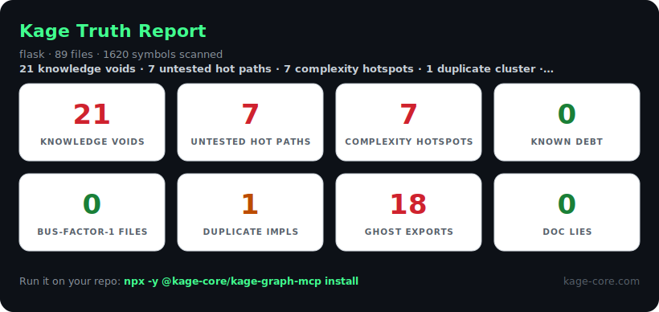
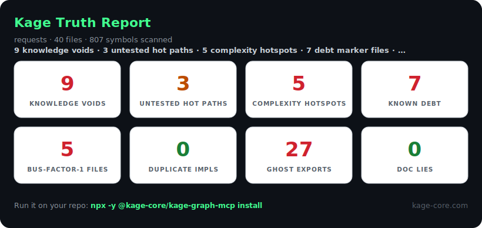
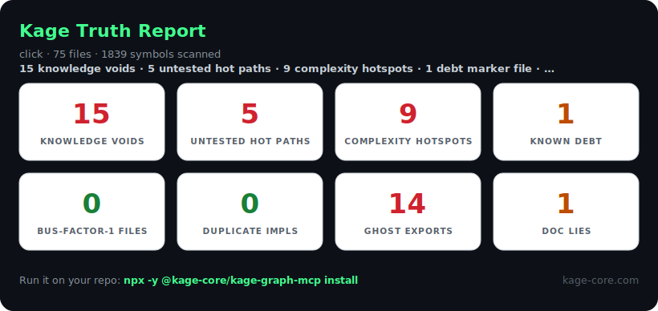
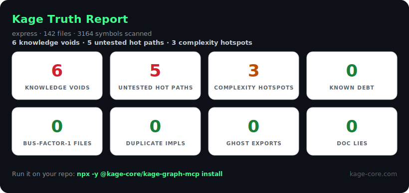
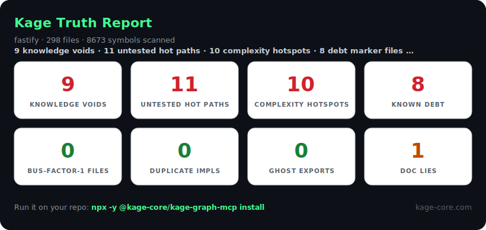
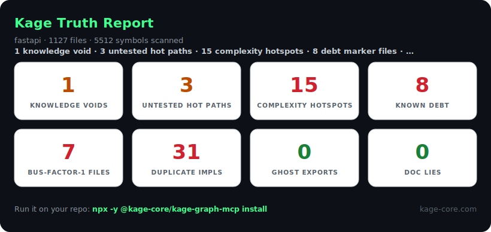
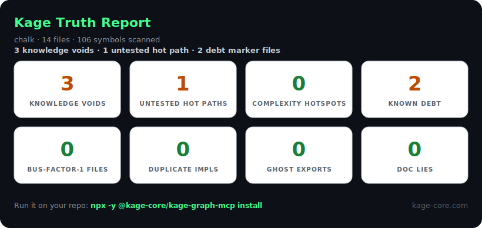
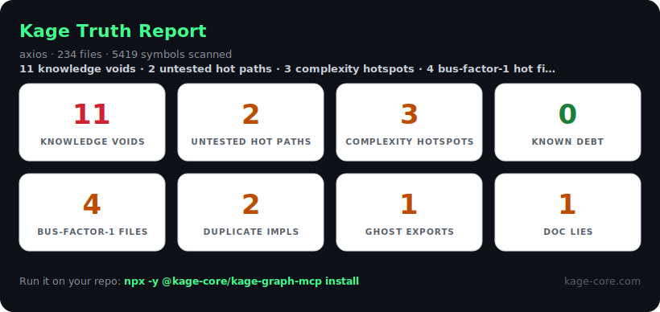

# Scorecard showcase — real `kage scan` runs on famous repos

Top-of-funnel content batch. Every card below is a **real, reproducible** run of
`kage scan --scorecard` against the public repo — no mockups, no cherry-picking
the numbers. Each is a self-contained social post: a scorecard image + a one-line
hook + the install CTA built into the card.

**Reproduce any of these:**

```bash
git clone --depth 200 https://github.com/<org>/<repo>.git
npx -y @kage-core/kage-graph-mcp scan --project <repo> --scorecard
```

## How to use this batch

- **One repo per post.** Post the SVG (`launch/scorecards/<name>.svg`) with the
  one-line hook. Drip 1–2 per week; don't dump all eight at once.
- **Tag the angle, not the repo's quality.** These are *knowledge-gap* signals —
  hot files with no docs/tests, exports nothing calls — not "bugs." The hook is
  always: *even the best repos have knowledge only a few heads hold; that's
  exactly what agent memory is for.* Never dunk on a project. If a maintainer
  replies, the move is "want the full `file:line` report? happy to share."
- **The CTA is in the image.** Every card ends with the install command, so the
  post works even when reshared without caption.

## Honesty / methodology notes (keep these straight if asked)

- Scans were run on **shallow clones (`--depth 200`)**, so git-history signals
  (bus-factor, churn-driven "knowledge voids") are *understated* on long-lived
  repos — the real numbers on a full clone are usually higher, not lower.
- "Ghost exports," "knowledge voids," etc. are **heuristic risk signals**, each
  cited to `file:line` in the full report (`kage scan` without `--scorecard`).
  They flag *where undocumented knowledge concentrates*, not defects.
- Counts shown are the cards as generated on the dates you run them; re-run before
  posting so the numbers match the live repo.

---

## Flask · `pallets/flask`



> **89 files, 1,620 symbols.** 21 hot files with no captured knowledge, 18 exports
> nothing in the repo calls. Even Flask has corners only a few maintainers hold in
> their heads — that's what agent memory is for.

## Requests · `psf/requests`



> **40 files, 807 symbols.** 27 ghost exports and 5 bus-factor-1 hot files — the
> most-downloaded Python library on earth still has single-owner hotspots. Memory
> shouldn't live in one person's head.

## Click · `pallets/click`



> **75 files, 1,839 symbols.** 15 knowledge voids, 9 complexity hotspots, and a
> doc that no longer matches the code. `kage scan` finds the doc lie and cites it.

## Express · `expressjs/express`



> **142 files, 3,164 symbols.** Cleaner than most — 0 ghost exports, 0 duplicates
> — but 6 hot files carry zero captured knowledge. A new contributor's agent
> starts blind on exactly those.

## Fastify · `fastify/fastify`



> **298 files, 8,673 symbols.** 11 untested hot paths and 8 debt markers sitting
> in central files. Every one is the kind of thing a teammate explained once in a
> PR thread and nobody wrote down.

## FastAPI · `tiangolo/fastapi`



> **1,127 files, 5,512 symbols.** 31 duplicate implementation clusters and 15
> complexity hotspots. At this scale, "didn't we already build this?" is a daily
> tax — Kage remembers what exists.

## Chalk · `chalk/chalk`



> **14 files, 106 symbols.** Small and tidy — mostly green. Proof the scan
> reassures as much as it warns: it tells you when a repo's knowledge is well
> distributed, too.

## Axios · `axios/axios`



> **234 files, 5,419 symbols.** 11 knowledge voids, 4 bus-factor-1 files, and a
> doc lie. One of the most-used HTTP clients anywhere, and its knowledge still
> concentrates in a handful of files.

---

## Caption templates

**Short (X / Bluesky):**
> Ran `kage scan` on {repo}: {N} hot files with zero captured knowledge, {M}
> exports nothing calls. Even great repos keep knowledge in a few heads. Run it on
> yours (60s, no install): `npx -y @kage-core/kage-graph-mcp scan --project .`

**Reddit / longer:**
> I pointed my repo-knowledge scanner at {repo}. It reads the repo in ~60s and
> flags where undocumented knowledge concentrates — hot files with no docs/tests,
> dead exports, docs that don't match the code — each cited to file:line. Here's
> {repo}'s card. Not a knock on the project; this is true of almost every mature
> codebase, and it's exactly the knowledge a coding agent re-learns from scratch
> every session. Run it on yours: `npx -y @kage-core/kage-graph-mcp scan --project .`
