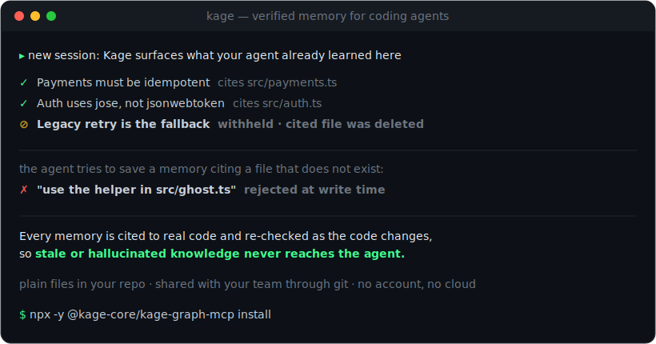

🌐 [English](../README.md) · [简体中文](README.zh-CN.md) · [日本語](README.ja.md) · 한국어 · [Español](README.es.md) · [Português (Brasil)](README.pt-BR.md) · [Français](README.fr.md) · [Deutsch](README.de.md) · [हिन्दी](README.hi.md)

<div align="center">

# Kage

### 신뢰할 수 있는 코딩 에이전트 메모리



코딩 에이전트는 세션마다 코드베이스를 잊어버리기 때문에 당신은 계속해서 다시 설명하게
됩니다. **Kage** 는 저장소 안에 일반 파일로 존재하는 영속 메모리를 제공하고, 모든 메모리를
실제 코드와 대조해 검증합니다. 그래서 에이전트가 더 이상 사실이 아닌 내용을 근거로
행동하는 일이 없습니다. git 을 통해 팀 전체와 공유됩니다. 계정 불필요, 데이터베이스 불필요,
API 키 불필요.

```bash
npx -y @kage-core/kage-graph-mcp install
```

<p>
  <a href="https://www.npmjs.com/package/@kage-core/kage-graph-mcp"></a>
  <a href="https://www.npmjs.com/package/@kage-core/kage-graph-mcp"></a>
  
  
  
</p>

<p>
  <a href="https://kage-core.com/">웹사이트</a> ·
  <a href="https://kage-core.com/guide.html">문서</a> ·
  <a href="https://kage-core.com/viewer/">라이브 뷰어</a> ·
  <a href="https://www.npmjs.com/package/@kage-core/kage-graph-mcp">npm</a> ·
  <a href="https://kage-core.com/demo.html"><b>데모 예약</b></a>
</p>

**지원** Claude Code · Codex · Cursor · Windsurf · Gemini CLI · Cline · Goose ·
Roo Code · Kilo Code · OpenCode · Aider · Claude Desktop · 모든 MCP 클라이언트

</div>

---

## 설치

**저장소 안에서 명령 하나, 그다음 에이전트 재시작.** 설정은 이게 전부입니다.

```bash
npx -y @kage-core/kage-graph-mcp install
```

`.agent_memory/` 를 만들고, 코드 그래프를 구축하고, 에이전트에게 Kage 를 쓰라고 알려주는
`AGENTS.md` / `CLAUDE.md` 정책을 작성하고, 에이전트를 자동 감지해 연결하며, `.gitignore` 와
packet 병합 드라이버를 구성합니다. Node.js 18+ 필요. 계정 불필요, API 키 불필요.

**또는 에이전트에게 설정을 맡기세요.** 아래 문장을 Claude Code, Cursor, 혹은 어떤 코딩
에이전트에든 붙여넣으세요:

> 이 저장소에 Kage(코딩 에이전트를 위한 검증된 메모리, https://github.com/kage-core/Kage)를
> 설정해줘: `npx -y @kage-core/kage-graph-mcp install` 을 실행한 다음, 나에게 너를 재시작하라고
> 알려줘.

<details><summary>다른 방법 (플러그인 · 개별 에이전트 · 메모리만)</summary>

```bash
# Claude Code / Codex 플러그인
/plugin marketplace add kage-core/Kage      # 그다음: /plugin install kage@kage

# 단일 에이전트 연결 (전체 지원 목록은 kage setup list)
kage setup claude-code --project . --write

# 메모리 저장소만, 에이전트 연결 없음
kage init --project .

# 하네스가 작동 중인지 확인
kage setup verify-agent --agent claude-code --project .
```
</details>

## Kage 란

Kage 는 코딩 에이전트를 위한 메모리 계층입니다. 에이전트가 작업하면서 배운 것(결정,
버그 수정, 관례, 코드가 서로 맞물리는 방식)을 `.agent_memory/` 아래에 저장소와 함께
커밋되는 작은 JSON **packet** 으로 포착합니다. 다음 세션(당신 또는 동료의)은 다시 읽거나
다시 묻지 않고, 이미 그것을 아는 상태로 시작합니다.

다른 메모리 도구와 다른 두 가지:

- **검증됩니다.** 모든 메모리는 자신이 다루는 코드를 인용하고, Kage 는 그 인용을 쓰기 시점,
  회상 시점, 그리고 diff 가 코드를 바꿀 때 실제 파일과 대조합니다. 코드와 더 이상 맞지 않는
  메모리는 보류되므로, 에이전트가 낡은 주장을 근거로 행동하지 않습니다.
- **git 네이티브입니다.** 메모리는 저장소 안의 일반 파일로, 코드와 같은 PR 에서 리뷰되고
  git 을 통해 팀 전체와 공유됩니다. 한 대의 머신이나 벤더의 클라우드에 갇히지 않습니다.

## 작동 방식

설치 후에는 백그라운드에서 동작하며, 직접 무언가를 실행할 필요가 없습니다:

1. **행동하기 전에 회상.** 작업 시작 시(그리고 에이전트가 파일을 여는 순간) Kage 는 관련된
   검증된 메모리를 제시합니다. 낡았거나 삭제된 메모리는 제외됩니다.
2. **작업하면서 포착.** 지속적인 학습은 packet 이 됩니다. 존재하지 않는 파일을 인용하는
   메모리는 그 자리에서 거부되므로, 환각이 저장소에 들어가지 않습니다.
3. **코드가 움직여도 정직하게.** diff 가 메모리가 인용한 코드를 바꾸면, 그 메모리는
   커밋/PR 시점(`kage pr check`)에 표시되고, 재검증되거나 교체될 때까지 회상에서 보류됩니다.
   그래서 지식이 조용히 썩지 않습니다.

**로컬 대시보드**(`kage viewer`)에서 그 과정을 지켜보세요: packet, 메모리↔코드 그래프,
신뢰 게이트, 에이전트가 작업하는 동안 흘러드는 실시간 이벤트. `<private>…</private>` 로
감싼 것은 절대 저장되지 않습니다.

## 왜 Kage 인가

대부분의 메모리 도구([claude-mem](https://github.com/thedotmack/claude-mem),
[agentmemory](https://github.com/rohitg00/agentmemory), mem0, Zep)는 메모리를 한 대의 머신이나
당신 소유가 아닌 클라우드에 저장하며, 코드와 다시 대조하지 않습니다. Kage 는 메모리를
당신의 저장소에 두고 검증합니다. 그래서 팀의 것으로 남고, 코드가 바뀌어도 사실로 남습니다.

| | Kage | claude-mem | mem0 / Zep |
|---|---|---|---|
| 자동 포착 + 세션 시작 시 회상 | ✓ | ✓ | SDK 경유 |
| 환각 인용을 **쓰기 시점에 거부** | ✓ | — | — |
| 낡은 메모리를 **회상 시점에 보류**(인용 파일 삭제/변경, TTL, 신고) | ✓ | — | — |
| **diff 시점 낡음 감지**: 변경이 메모리를 깨면 PR 전에 경고 | ✓ | — | — |
| 메모리를 git 에서 리뷰, 코드와 같은 PR(일반 파일, DB 없음) | ✓ | SQLite + 클라우드 | 호스티드 API |
| 메모리를 에이전트가 자동 로드하는 팀 `SKILL.md` 로 고정 | ✓ (`kage skills`) | — | — |
| 머신 간 동기화 | ✓ 당신의 git 리모트 | 각사 클라우드 | 각사 클라우드 |
| 계정 / API 키 필요 여부 | 불필요 | 클라우드는 선택 | 필요 |

## 기능

- **Truth Report.** `kage scan` 은 어떤 저장소든 약 60초에 읽어, 가장 위험한 지식 공백을
  드러냅니다: 문서 없는 핫 파일, 테스트 없는 핫 패스, 복잡도 핫스팟, 미해결 기술 부채,
  버스 팩터 1 파일. 그리고 (존재한다면) 중복 구현, 데드 익스포트, 문서의 거짓말까지.
  모든 결과는 `file:line` 으로 명시. 설정 불필요, 아무것도 생성하지 않으며, 무언가를
  설치하기 전에 실행할 수 있습니다.
- **절감 영수증.** `kage gains` 는 저장소별 가치 장부(에이전트가 다시 쓰지 않아도 된 토큰과
  비용)를 유지하며, 모든 수치는 기록된 이벤트까지 추적됩니다. 에이전트는 회상할 때마다
  그것을 전달합니다.
- **팀 스킬.** `kage skills` 는 지속적이고 검증된 절차를 에이전트가 자동 로드하는
  `.claude/skills/<name>/SKILL.md` 파일로 변환합니다. 커밋해 공유, 클라우드 없음.
- **개인 메모리 및 동기화.** `kage learn --personal` 은 머신 간 메모를 `~/.kage/memory` 에
  보관하고, 명확히 구분된 더 낮은 신뢰 섹션으로 회상되며, 당신의 git 리모트로 동기화됩니다.
- **자가 치유 세션 루프.** 포착되지 않은 세션은 자동으로 증류되어 검토 대기 초안이 됩니다.
  `kage resume` 는 각 세션을 "이전 줄거리" 요약으로 시작합니다. `kage repair` 는 깨진 packet 과
  인덱스를 명령 하나로 고칩니다.

## 벤치마크

- **동일한 정확도에서 grep 보다 18% 빠름**, 실제 코드 내비게이션 작업 기준(N=3 스위트,
  동일 에이전트/모델; `kage benchmark --project . --compare` 로 재현).
- **LongMemEval-S 검색:** 96.17% R@5 / 98.72% R@10, 의존성 0.
- **변경 하 메모리 정확성:** 낡은 제공 0%(삭제·변경된 코드의 메모리는 보류), "전부 포착"형
  저장소의 100% 대비.
- **신뢰 벤치마크:** 100/100, 환각 거부·낡음 제외·실시간 대조를 포함
  (`kage benchmark --trust --project .`).

방법론, 명령, 주의사항: [docs/BENCHMARKS.md](../docs/BENCHMARKS.md).

## 일상 명령

```bash
kage recall "테스트 실행 방법" --project .
kage verify --project .        # 인용을 현재 코드와 대조
kage pr check --project .      # 낡음 감지 + 그래프 신선도 게이트
kage gains --project .         # Kage 가 절약해 준 것
kage viewer --project .        # 로컬 대시보드
```

전체 CLI 및 MCP 레퍼런스: [문서](https://kage-core.com/guide.html).

## 저장

모든 것은 `.agent_memory/` 아래에 있습니다: `packets/` 는 저장소와 함께 커밋되는 영속 메모리
(git 추적 JSON); `graph/`, `code_graph/`, `structural/`, `indexes/` 는 `kage refresh` 로 재구축
가능; `reports/` 는 가치 장부와 상태 보고서를 보관합니다. 포착 전에 비밀과 PII 를 스캔합니다.

## 개발

```bash
cd mcp
npm install
npm test
npm run build
```

## 라이선스

GPL-3.0-only. [LICENSE](../LICENSE) 참조. GPL 전환 이전 릴리스는 MIT 였습니다.
