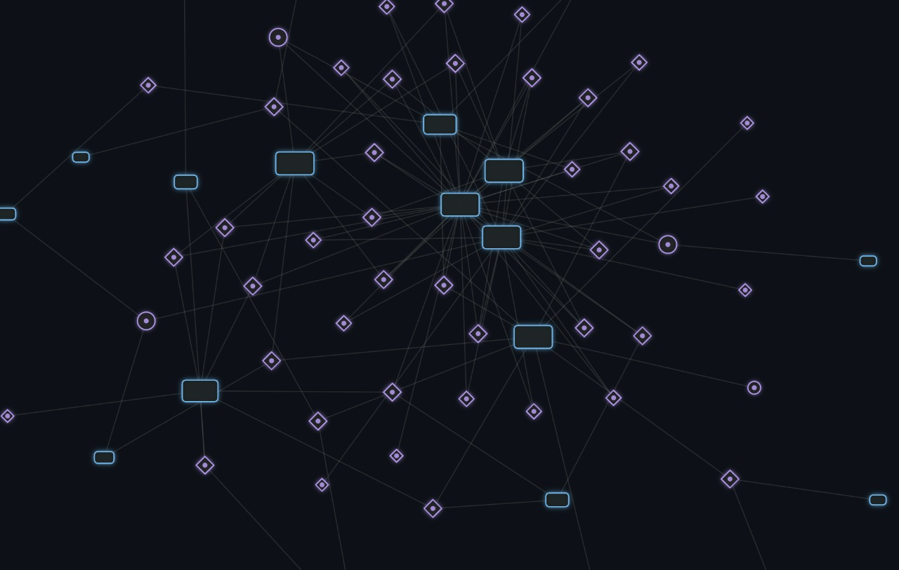

🌐 [English](../README.md) · [简体中文](README.zh-CN.md) · [日本語](README.ja.md) · [한국어](README.ko.md) · [Español](README.es.md) · Português (Brasil) · [Français](README.fr.md) · [Deutsch](README.de.md) · [हिन्दी](README.hi.md)

<div align="center">

# Kage

### Memória de equipe para agentes de código que nunca se perde



<sub>`kage viewer`: as decisões, runbooks e correções de bugs do seu time (roxo), guardadas no repo e ligadas ao código de que tratam (azul).</sub>

As decisões por trás da sua base de código, o runbook de um deploy delicado, a causa raiz de
um bug chato: esse conhecimento vive na cabeça das pessoas e some entre as mensagens do chat.
O **Kage** o captura enquanto seus agentes de código trabalham, guarda como arquivos de texto
puro no seu repositório e compartilha com todo o time via git. A próxima sessão, sua ou de um
colega, já começa sabendo. Cada memória também é conferida com o código real, então o que é
compartilhado continua verdadeiro. Sem conta, sem banco de dados, sem chave de API.

```bash
npx -y @kage-core/kage-graph-mcp install
```

<p>
  <a href="https://www.npmjs.com/package/@kage-core/kage-graph-mcp"></a>
  <a href="https://www.npmjs.com/package/@kage-core/kage-graph-mcp"></a>
  
  
  
</p>

<p>
  
  
  
  
  
</p>

<p>
  <a href="https://kage-core.com/">Site</a> ·
  <a href="https://kage-core.com/guide.html">Documentação</a> ·
  <a href="https://kage-core.com/viewer/">Visualizador ao vivo</a> ·
  <a href="https://www.npmjs.com/package/@kage-core/kage-graph-mcp">npm</a> ·
  <a href="https://kage-core.com/demo.html"><b>Agendar demo</b></a>
</p>

**Funciona com** Claude Code · Codex · Cursor · Windsurf · Gemini CLI · Cline · Goose ·
Roo Code · Kilo Code · OpenCode · Aider · Claude Desktop · qualquer cliente MCP

</div>

---

## Instalação

**Um comando, dentro do seu repositório, e depois reinicie seu agente.** Essa é toda a configuração.

```bash
npx -y @kage-core/kage-graph-mcp install
```

Ele cria `.agent_memory/`, constrói o grafo de código, escreve a política
`AGENTS.md` / `CLAUDE.md` que instrui os agentes a usar o Kage, detecta e conecta seus
agentes automaticamente, e configura `.gitignore` + o driver de merge de packets.
Requer Node.js 18+. Sem conta, sem chave de API.

**Ou simplesmente peça ao seu agente para configurar.** Cole isto no Claude Code, Cursor ou
qualquer agente de código:

> Configure o Kage (memória verificada para agentes de código, https://github.com/kage-core/Kage)
> neste repositório: rode `npx -y @kage-core/kage-graph-mcp install` e depois me avise para te reiniciar.

<details><summary>Outras formas (plugin · por agente · só memória)</summary>

```bash
# Plugin do Claude Code / Codex
/plugin marketplace add kage-core/Kage      # depois: /plugin install kage@kage

# conectar um único agente (rode kage setup list para ver todos os suportados)
kage setup claude-code --project . --write

# apenas o armazenamento de memória, sem conectar agentes
kage init --project .

# confirmar que o harness está ativo
kage setup verify-agent --agent claude-code --project .
```
</details>

## O que é o Kage

O Kage é uma camada de memória para agentes de código. Enquanto seu agente trabalha, ele
captura o que aprende (decisões, correções de bugs, convenções, como o código se encaixa)
como pequenos **packets** JSON versionados no seu repositório em `.agent_memory/`. A próxima
sessão (sua ou de um colega) já começa sabendo disso, em vez de reler ou perguntar de novo.

Três coisas o tornam diferente de outras ferramentas de memória:

- **É colaborativo.** O que uma pessoa (ou o agente dela) descobre passa a ser de todo o time.
  A memória é compartilhada via git, então a próxima sessão de um colega começa com o que você
  acabou de aprender, não do zero.
- **É nativo de git.** A memória são arquivos de texto puro no seu repositório, revisados no
  mesmo PR que o código, não presos a uma máquina ou à nuvem de um fornecedor. Seu conhecimento
  continua sendo seu.
- **É verificado.** Cada memória cita o código de que trata, e o Kage confere essas citações
  com seus arquivos reais: na escrita, na recordação e quando um diff muda o código. A memória
  que não corresponde mais ao código é retida, para que o agente nunca aja sobre uma afirmação
  obsoleta.

## Como funciona

Depois de instalado, é ambiente. Você não roda nada na mão:

1. **Recordar antes de agir.** No início de uma tarefa (e no momento em que o agente abre um
   arquivo), o Kage apresenta a memória verificada relevante. Memória obsoleta ou apagada fica de
   fora.
2. **Capturar enquanto trabalha.** Aprendizados duradouros viram packets. Uma memória que cita um
   arquivo que não existe é rejeitada na hora, então alucinações nunca entram no armazenamento.
3. **Manter-se honesto à medida que o código muda.** Quando um diff muda código que uma memória
   cita, essa memória é sinalizada no commit/PR (`kage pr check`) e retida da recordação até ser
   reverificada ou substituída, para que o conhecimento não apodreça em silêncio.

Acompanhe no **painel local** (`kage viewer`): packets, o grafo memória↔código, os portões de
confiança e os eventos ao vivo conforme o agente trabalha. Qualquer coisa envolta em
`<private>…</private>` nunca é armazenada.

## Por que o Kage

A maioria das ferramentas de memória ([claude-mem](https://github.com/thedotmack/claude-mem),
[agentmemory](https://github.com/rohitg00/agentmemory), mem0, Zep) guarda a memória por máquina ou
em uma nuvem que não é sua, e nunca a confere com o código. O Kage a mantém no seu repositório e a
verifica, então ela continua sendo do seu time e continua verdadeira conforme o código muda.

| | Kage | claude-mem | mem0 / Zep |
|---|---|---|---|
| Captura automática + recordação no início da sessão | ✓ | ✓ | via SDK |
| Citações alucinadas **rejeitadas na escrita** | ✓ | — | — |
| Memória obsoleta **retida na recordação** (arquivos citados apagados/mudados, TTL, reportada) | ✓ | — | — |
| **Detecção de obsolescência no diff**: avisa antes do PR quando sua mudança quebra uma memória | ✓ | — | — |
| Memória revisada no git, no mesmo PR que o código (arquivos puros, sem BD) | ✓ | SQLite + nuvem | API hospedada |
| Codificar a memória em arquivos `SKILL.md` de time que os agentes autocarregam | ✓ (`kage skills`) | — | — |
| Sincronização entre máquinas | ✓ seu próprio remoto git | nuvem deles | nuvem deles |
| Exige conta / chave de API? | nenhuma | nuvem opcional | sim |

## Recursos

- **Relatório da Verdade.** O `kage scan` lê qualquer repositório em ~60s e revela suas lacunas de
  conhecimento de maior risco: arquivos quentes sem documentação, caminhos quentes sem testes,
  pontos quentes de complexidade, dívida de código não resolvida e arquivos com fator ônibus 1;
  além de implementações duplicadas, exportações mortas e mentiras na documentação quando existem.
  Cada achado citado em `file:line`. Sem configuração, sem gerar nada, roda antes de instalar
  qualquer coisa.
- **Recibos de economia.** O `kage gains` mantém um livro de valor por repositório (tokens + $ que
  o agente não precisou gastar de novo), com cada número rastreável a um evento registrado; o
  agente o repassa após cada recordação.
- **Skills de time.** O `kage skills` transforma procedimentos duradouros e verificados em arquivos
  `.claude/skills/<name>/SKILL.md` que os agentes autocarregam, versionados e compartilhados, sem nuvem.
- **Memória pessoal e sincronização.** O `kage learn --personal` mantém notas entre máquinas em
  `~/.kage/memory`, recordadas como uma seção de menor confiança claramente separada e sincronizadas
  pelo seu próprio remoto git.
- **Loop de sessão autorreparável.** Sessões não capturadas são destiladas automaticamente em
  rascunhos pendentes que você revisa; o `kage resume` abre cada sessão com um resumo «anteriormente…»;
  o `kage repair` conserta packets e índices quebrados com um comando.

## Benchmarks

- **18% mais rápido que o grep com a mesma exatidão** em tarefas reais de navegação de código (suíte
  N=3, mesmo agente/modelo; reproduza com `kage benchmark --project . --compare`).
- **Recuperação LongMemEval-S:** 96.17% R@5 / 98.72% R@10, zero dependências.
- **Exatidão da memória sob mudança:** 0% de obsoletas servidas (a memória cujo código foi apagado ou
  mudado é retida), contra 100% dos armazéns que capturam tudo.
- **Benchmark de confiança:** 100/100, cobrindo rejeição de alucinações, exclusão de obsoletas e
  ancoragem ao vivo (`kage benchmark --trust --project .`).

Metodologia, comandos e ressalvas: [docs/BENCHMARKS.md](../docs/BENCHMARKS.md).

## Comandos diários

```bash
kage recall "como eu rodo os testes" --project .
kage verify --project .        # confere as citações com o código atual
kage pr check --project .      # detecção de obsolescência + portão de frescor do grafo
kage gains --project .         # o que o Kage te economizou
kage viewer --project .        # painel local
```

Referência completa de CLI e MCP: [documentação](https://kage-core.com/guide.html).

## Armazenamento

Tudo vive em `.agent_memory/`: `packets/` é a memória persistente do repositório (JSON versionado
no git); `graph/`, `code_graph/`, `structural/` e `indexes/` são reconstruídos com `kage refresh`;
`reports/` guarda o livro de valor e os relatórios de saúde. A captura escaneia segredos e PII antes
de gravar.

## Desenvolvimento

```bash
cd mcp
npm install
npm test
npm run build
```

## Licença

GPL-3.0-only. Veja [LICENSE](../LICENSE). As versões anteriores à mudança para GPL eram MIT.
